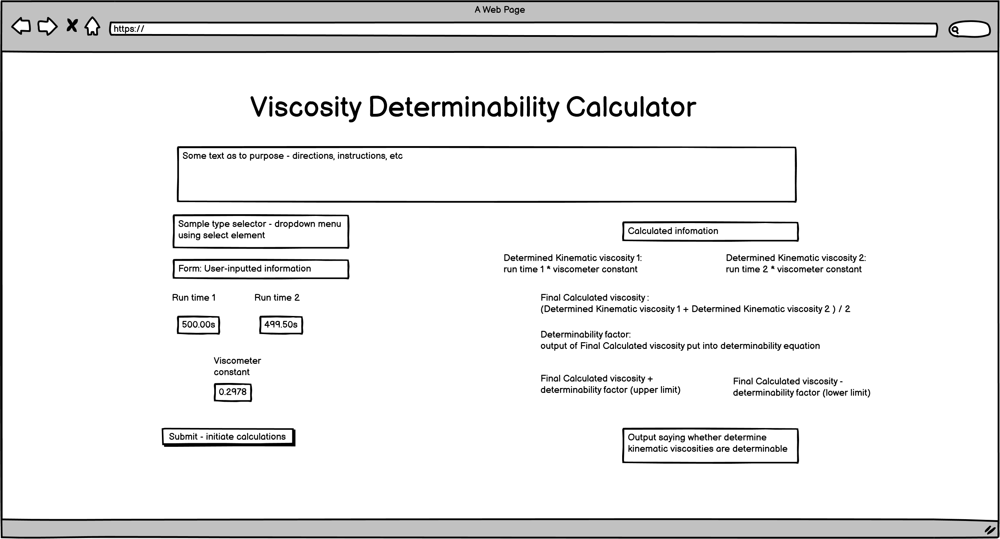
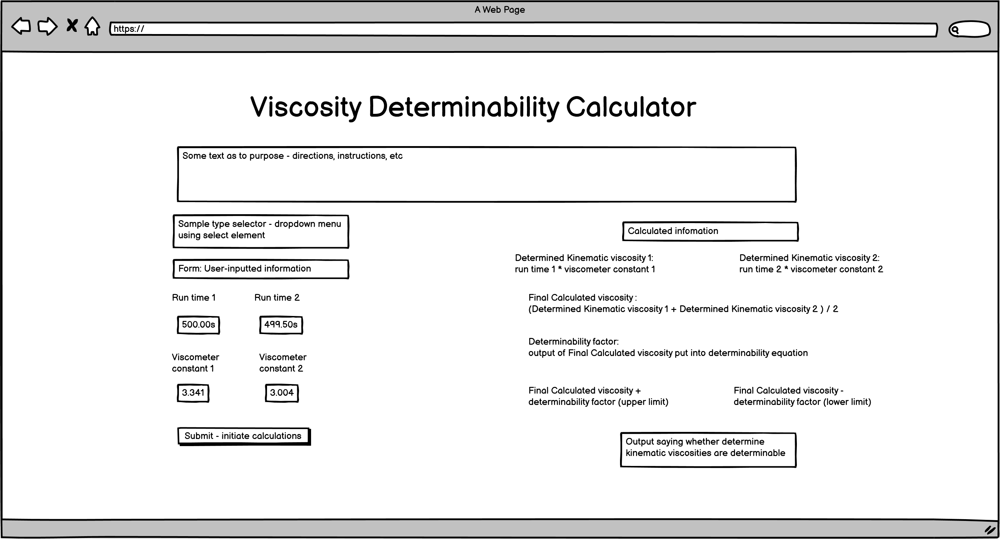
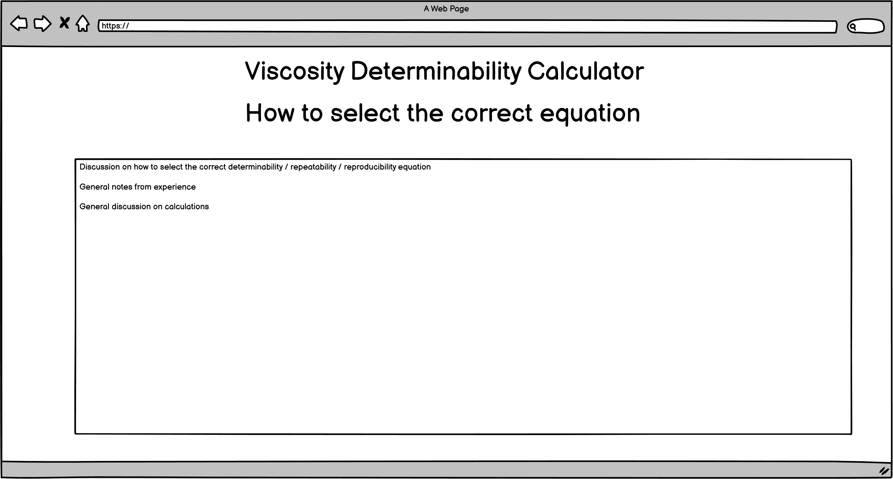
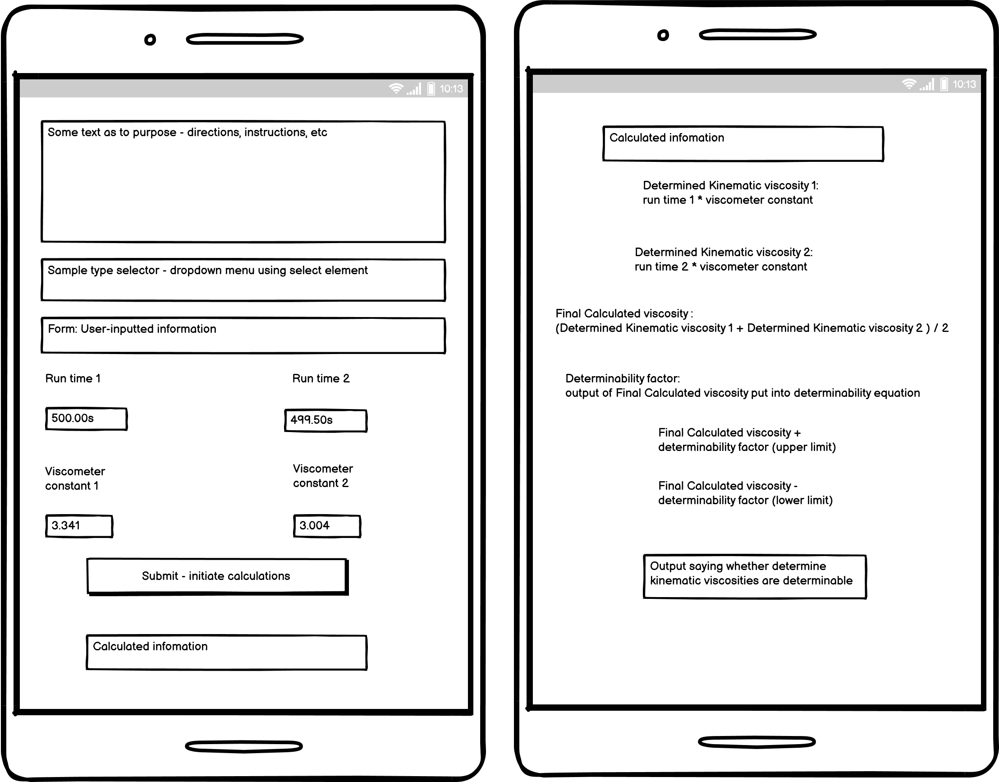
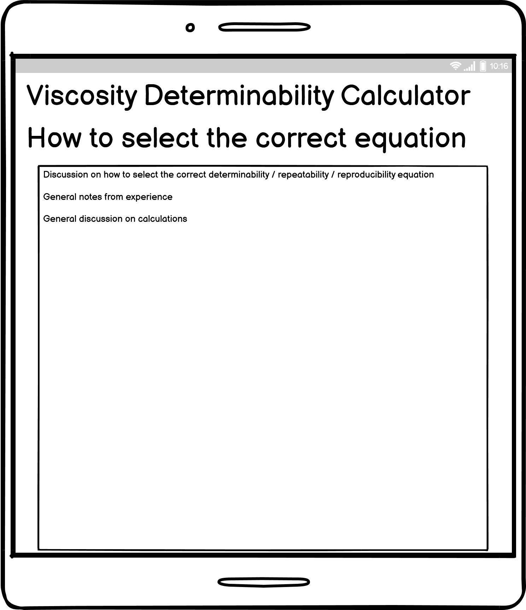

# Viscosity Calculator

# Code Institute Portfolio Project 2: User-centric interactive front-end site using HTML, CSS and JS

# Table of Contents

- [Table of Contents](#table-of-contents)
- [Background](#background)
- [Scope](#scope)
- [Audience](#audience) 
- [User Stories](#user-stories)
- [Wireframes](#wireframes)
    - [Initial Wireframes](#initial-wireframes)
    - [Final Wireframes](#final-wireframes)
- [Function](#function)
- [Features](#features)
    - [User feedback](#user-feedback)
- [Design Choices](#design-choices)
- [Accessibility](#accessibility)
- [Code explanations](#code-explanations)
- [Future Work](#future-work)
- [Bugs](#bugs)
- [Technologies](#technologies)
- [Deployment](#deployment)
    - [How this project was deployed](#how-this-project-was-deployed)
    - [How other users can work on this project](#how-other-users-can-work-on-this-project)
        - [Direct access](#direct-access)
        - [Template](#template)
        - [Local clone](#local-clone)
        - [Collaboration](#collaboration)
        - [Development preview browser](#development-preview-browser)
- [Testing](#testing)
    - [Testing User Stories](#testing-user-stories)
    - [Testing Functionality](#testing-functionality)
    - [Testing on different devices](#testing-on-different-devices)
    - [Testing code](#testing-code)
- [Credits](#credits)
    - [Code](#code)
    - [Acknowledgements](#acknowledgements)

# Background

By training and profession, I am a chemist. I have a first-class honours degree in chemistry and have worked in laboratories for all of my career. My current position is with Intertek, testing all manner of petrochemical products - lubricating oils, additives and crude oils. 

My informal specialty within my team is in the analysis of viscosity, and I do the vast majority of viscosity tests that we are contracted to perform. 

Broadly speaking, viscosity is a measurement of how well a fluid material resists flow - a higher viscosity means that the fluid has a greater resistance to flow, and a lower viscosity means that the fluid has a lesser resistance to flow. Honey, for example, is a fluid of relatively high viscosity, whereas water is a fluid of very low viscosity. 

Viscosity isn't a loose definition - it can be measured with great accuracy in laboratories by several different means, and at different temperatures. The most common measurement that I do in my profession life is that of kinematic viscosity. In commercial laboratories, the procedures for the making of measurements are laid down in industry standard test methods written, published and reviewed by standards organisations. In my line of work, two of the best-regarded such organisations are the American Society for Testing and Materials (ASTM) and the Institute of Petroleum (IP). Both organisations publish standard test methods for the measurement of kinematic viscosity. These are the ASTM D445 and the IP 71 methods, though both are functionally equivalent. 

Both of these methods state that kinematic viscosity is to be measured by a means of a glass instrument called a viscometer, and several different designs are available based on particular requirements, though the most common are the Ubbelohde type and the Zeitfuchs cross-arm type. The Ubbelohde type consists of a reservoir that holds the fluid, a bulb with timing marks and a capillary (a thin tube, essentially) through which the fluid flows. By means of a vacuum, the fluid is drawn from the reservoir through the capillary and into the bulb. When the vacuum is released, the fluid begins to drain back down through the capillary. When the fluid front drains past the first timing mark, a stop-watch or timer is started, and when the fluid front drains past the second timing mark, the timer is stopped. 

The Zeitfuchs cross-arm type consists of the same features, except that the reservoir sits above the bulb, and the fluid is drawn forwards by vacuum through the capillary. When the fluid passes the first timing mark, a timer is started and when the fluid passes the second mark, it is stopped. Whereas a fluid in the Ubbelohde type can be tested repeatedly, the Zeitfuchs type is a 'one-shot' viscometer, though this makes it useful for extremely dark fluids that would obscure the timing marks on an Ubbelohde viscometer. 

Both type of viscometer produce a time when used to test the fluid. This time is multiplied by a constant that is unique to each viscometer, and this produces a kinematic viscosity value. However, one kinematic viscosity isn't sufficient, and both of the above methods specify that two such measurements must be made. These two measurements are then averaged. 

At this point, you may be wondering as to the purpose of this project - multiplication and averaging are simple mathematical operations that don't require an entire website to do, surely? A pocket calculator could be used. 

This is indeed true. However, the methods specify that not just any two kinematic viscosities can be used for the final averaging calculation - they need to be close enough that they are approximately the same, and hence that the final averaged value is a good representation of the actual viscosity of the fluid. For example, say you measured two kinematic viscosities of 100 and 80. The final averaged value would be 90, which is nowhere near either value, and could hence mislead the client. 

To check whether the two values that have been obtained are close enough, the methods contain a series of calculations for different fluid types that specify a concept called determinability. These calculations effectively define a band within whose limits the two measured kinematic viscosities must fall. Kinematic viscosities that meet this criterion are said to be 'determinable'. 

These calculations aren't particularly complex, but they do add several extra calculations, requiring the scientist to carry around a calculator and a notepad, to remember or be able to easily reference the different calculations, and to have the time to perform them. This is an extra hassle that I reckon can be done away with using this tool. 

# Scope

The scope of this project is to automate as much as possible all of the calculations involved in the ASTM D445 and IP 71 kinematic viscosity methods. All the user should have to do is input their run-times and the constant or constants of the viscometers used in the test. The tool will then use a series of functions to perform all of the calculations, display the results of these calculations and then display a final message indicating whether or not the two results are determinable. Since it is common for commercial scientists to use their personal smartphones in the lab for their calculator apps, this tool should be fully useable and responsive on a smartphone. 

# Audience

This tool is designed wholly for profession scientists in commercial petrochemical laboratories who perform kinematic viscosity tests. I stress that it is conceived of as a tool rather than an interactive website. As it is designed for work purposes, styling is minimal, with the main positive aspects of the User Experience delivered via the logic and calculations. 

# User stories

First-time users must be able to determine the purpose of the tool as soon as they navigate to it. 

The tool must include a selector to allow the user to select the fluid type that their sample is, and this selector must change that functions that are executed so that the correct calculations are made

The tool must include a page with some information on how to set the selector to the fluid type that matches their sample 

The above page should either open a new tab, or include an internal link to take the user back to the main page so that they don't have to user their browser butttons. 

The tool must have clear calls to action to input the user's run-times and viscometer constant(s)

The tool must have a clear call to action to submit their inputs and begin the calculations

The tool must display all calculation outputs so that the user is reassured of the tool's accuracy and can follow along performing the calculations manually if they desire

The tool's functions must produce the same calculation outputs as manual calculations would (i.e. no difference between the tool and the user doing the same calculations manually)

The tool must have a function to clear the user's inputs so that other tests of different fluids with different viscometers can be checked

The tool must have a clear final output informing the user whether their run-times produce determinable kinematic viscosities

# Wireframes

## Initial Wireframes

### Desktop

 
Since this is more of a tool than a website, I thought that the input form and calculations were best placed directly on the index page, rather than on a dedicated page that required internal navigation 
 
 

 
This is how the tool will appear if the selector is set to a Zeitfuchs cross-arm viscometer test, with two run-time inputs and two constant inputs
 
 

 
This is the discussion page that guides the user on how to set the selector to the correct option based on their sample type
 

### Smartphone

 
The index page as it designed to look on a smartphone
 
 

 
This is how the tool will appear if the selector is set to a Zeitfuchs cross-arm viscometer test, with two run-time inputs and two constant inputs
 
 

 
This is the discussion page that guides the user on how to set the selector to the correct option based on their sample type
 

## Final Wireframes

### Desktop

### Smartphone

# Function

# Features

# Design Choices

# Accessibility

# Code Explanations

# Future work

This project has great scope for future work. 

Firstly, determinability isn't the only concept discussed by the methods. There are also the concepts of repeatability and reproducibility, which specify the limits that kinematic viscosities must fall within if the sample is being retested either internally (repeatability) or externally(reproducibility). Expanding the tool to cover these calculations would be a worthy addition, and would bring it closer to fully automating all of the calculations specified in the methods

Secondly, a function could be added that exports all of the inputted and calulated data to an Excel spreadsheet so that permanent electronic records can be kept

Thirdly, a database of sorts could be added that stores all viscometer serial numbers and constants. Serial numbers are simple and unique, whilst constants can be more difficult to remember. The user could, instead of entering a constant, merely select the serial number of the viscometer they used and the tool would populate the cell with the constant for use in the calculations. This would tie in with the above

The tool could be expanded greatly to handle the calculations involved in other industrial methods, such as ASTM D2896 Total Base Number. 

# Bugs

# Technologies

# Deployment

# Testing

# Credits

