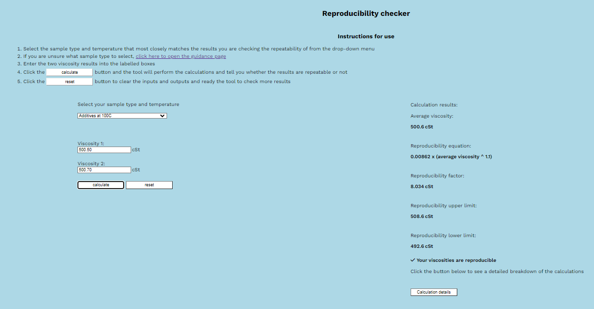
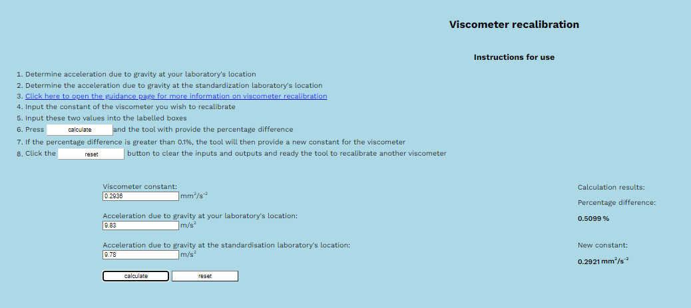
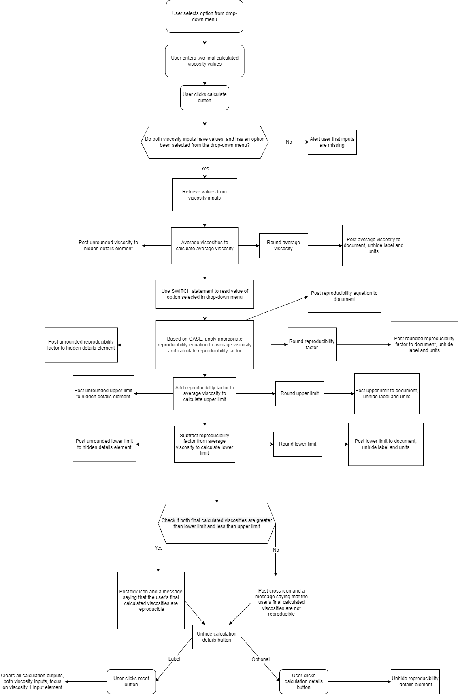

# **Viscosity Calculator**

# **Code Institute Portfolio Project 2: User-centric interactive front-end site using HTML, CSS and JS**

# **Table of Contents**

- [Table of Contents](#table-of-contents)
- [Background](#background)
- [Scope](#scope)
- [Audience](#audience) 
- [User Stories](#user-stories)
- [Wireframes](#wireframes)
    - [Initial Wireframes](#initial-wireframes)
    - [Final Wireframes](#final-wireframes)
- [Features](#features)
    - [Header and calculation selector](#header-and-selector)
    - [Calculation articles](#calculation-articles)
    - [Determinability calculation article](#determinability-calculation-article)
    - [Repeatability and reproducibility calculation articles](#repeatability-calculation-article)
    - [Calibration calculation article](#calibration-calculation-article)
    - [Recalibration calculation article](#recalibration-calculation-article)
    - [Calculation details](#calculation-details)    
- [Function](#function)
    - [Calculation selector logic](#calculation-selector-logic)
    - [Determinability logic](#determinability-logic)
        - [Determinability logic flow chart](#determinabilty-logic-flow-chart)
    - [Repeatability logic](#repeatability-logic)
        - [Repeatability logic flow chart](#repeatability-logic-flow-chart)
    - [Reproducibility logic](#reproducibility-logic)
        - [Reproducibility logic flow chart](#reproducibility-logic-flow-chart)
    - [Calibration logic](#calibration-logic)
        - [Calibration logic flow chart](#calibration-logic-flow-chart)
    - [Recalibration logic](#recalibration-logic)
        - [Recalibration logic flow chart](#recalibration-logic-flow-chart)
- [Design Choices](#design-choices)
    - [Colour scheme](#colour-scheme)
    - [Font](#font)
    - [Icons](#icons)
    - [Favicon](#favicon)
    - [JavaScript functions](#js-functions)
- [Accessibility](#accessibility)
- [Future Work](#future-work)
- [Bugs](#bugs)
- [Technologies](#technologies)
- [Deployment](#deployment)
    - [How this project was deployed](#how-this-project-was-deployed)
    - [How other users can work on this project](#how-other-users-can-work-on-this-project)
        - [Direct access](#direct-access)
        - [Template](#template)
        - [Local clone](#local-clone)
        - [Development preview browser](#development-preview-browser)
- [Testing](#testing)
    - [Testing User Stories](#testing-user-stories)
    - [Testing site functionality](#testing-site-functionality)
    - [Testing Calculation functions](#testing-calculation-functions)
        - [Determinability](#determinability-calculations)
        - [Repeatability](#recalibration-calculations)
        - [Reproducibility](#reproducibility-calculations)
        - [Calibration](#calibration-calculations)
        - [Recalibration](#recalibration-calculations)
    - [Testing on different devices](#testing-on-different-devices)
        - [PC](#pc)
        - [Laptop](#laptop)
        - [Smartphone](#smartphone)
        - [Tablet](#tablet)
    - [Testing code](#testing-code)
        - [HTML validation](#html-validation)
        - [CSS validation](#css-validation)
        - [JS validation](#js-validation)
        - [Lighthouse testing](#lighthouse-testing)
- [Credits](#credits)
    - [Resources](#resources)
    - [Acknowledgements](#acknowledgements)

# **Background**

By training and profession, I am a chemist. I have a first-class honours degree in chemistry and have worked in laboratories for all of my career. My current position is with Intertek, testing all manner of petrochemical products - lubricating oils, additives, crude oils, etc. 

My informal specialty within my team is in the analysis of viscosity, and I do the vast majority of viscosity tests that we are contracted to perform. 

Broadly speaking, viscosity is a measurement of how well a fluid material resists flow - a higher viscosity means that the fluid has a greater resistance to flow, and a lower viscosity means that the fluid has a lesser resistance to flow. Honey, for example, is a fluid of relatively high viscosity, whereas water is a fluid of very low viscosity. Invert a jar of honey, and it will take a long time to flow out, whereas if you invert a cup of water, it will pour out immediately. 

Viscosity isn't a loose definition - it can be measured with great accuracy in laboratories by several different means, and at different temperatures. The most common measurement that I do in my professional life is that of kinematic viscosity, which is essentially the resistance to flow under gravity. 

In commercial laboratories, the procedures for the making of measurements (any measurement, not just viscosity) are laid down in industry standard test methods that are written, published and reviewed by standards organisations. In my line of work, one of the best-regarded standards organisations is the American Society for Testing and Materials (ASTM). ASTM publishes standard test method D445 for the measurement of kinematic viscosity. It specifies in great detail the procedure for setting up and running a manual kinematic viscosity test.  

Both of these methods state that kinematic viscosity is to be measured by a means of a glass instrument called a viscometer, and several different designs are available based on particular requirements, though the most common are the Ubbelohde type and the Zeitfuchs cross-arm type. Images are below. The Ubbelohde type consists of a reservoir that holds the fluid, a bulb with timing marks and a capillary (a thin tube, essentially) through which the fluid flows. By means of a vacuum, the fluid is drawn from the reservoir through the capillary and into the bulb. When the vacuum is released, the fluid begins to drain back down through the capillary. When the fluid front drains past the first timing mark, a stop-watch or timer is started, and when the fluid front drains past the second timing mark, the timer is stopped.

An Ubbelohde viscometer looks like this:

The Zeitfuchs cross-arm type consists of the same features, except that the reservoir sits above the bulb, and the fluid is drawn forwards by vacuum through the capillary. When the fluid passes the first timing mark, a timer is started and when the fluid passes the second mark, it is stopped. Whereas a fluid in the Ubbelohde type can be tested repeatedly, the Zeitfuchs type is a 'one-shot' viscometer, though this makes it useful for extremely dark fluids such as crude oils that would obscure the timing marks on an Ubbelohde viscometer. 

A Zeitfuchs viscometer looks like this:

The time elapsed between when the fluid passes the first timing mark to when it passes the second timing mark is referred to variously - run-time is the most common, but drop-time and determination are also used. The methods specify that only run-times of between 200 and 900 seconds are valid - 200 because less than this means that the fluid is draining too fast for the scientist to start and stop the timer, and 900 seconds because spending more than 15 minutes to acquire a run-time is inefficient, and indicates that a larger viscometer may be safely used. 

This run-time is multiplied by a constant that is unique to each viscometer, and this produces a kinematic viscosity value. Viscometers come in standard sizes - 0C, 1, 1C, 2, 2C, 3, 3C, 4 and 4C, the constants increasing by a factor of 3 at each size - 0C's have the smallest constants, on the order of 0.003, 1's have constants on the order of 
0.01, etc. 4Cs have the largest constants, on the order of 30.00.  

However, one kinematic viscosity isn't sufficient, and D445 specifies that two such measurements must be made. These two measurements are then averaged. As with many scientific calculations, kinematic viscosity has a unit, and this is millimeters squared per second - **mm^2/s**. A more common unit is the centi-Stoke, **cSt**, and the two are equivalent - 1 mm^2/s = 1 cSt.

At this point, you may be wondering as to the purpose of this project - multiplication and averaging are simple mathematical operations that don't require an entire website to do, surely? A pocket calculator could be used, as could Excel formulas. 

This is indeed true. However, D445 specifies that not just any two kinematic viscosities can be used for the final averaging calculation - they need to be close enough that they are approximately the same, and hence that the final averaged value is a good representation of the actual viscosity of the fluid. For example, say you measured two kinematic viscosities of 100 cSt and 80 cSt. The final averaged value would be 90 cSt, which is nowhere near either value, and could hence mislead the client. 

To check whether the two values that have been obtained are close enough, D445 contains a series of calculations for different fluid types that specify a concept called determinability. These calculations effectively define a band within whose limits the two measured kinematic viscosities must fall. Kinematic viscosities that meet this criterion are said to be 'determinable', and hence valid for reporting to the client. 

Determinability is calculated by applying a determinability equation to the final calculated viscosity. This generates a determinability factor. The upper limit is calculated by adding the determinability factor to the final calculated viscosity, and the lower limit is calculated by subtracting the determinability factor from the final calculated viscosity. The two kinematic viscosities must be greater than the lower limit and less than the upper limit to be valid.  

The methods also specify several other calculations - repeatability, reproducibility, calibration and recalibration. Repeatability and reproducibility are concerned with repeat measurements of viscosity - by the same laboratory and by a different laboratory respectively. These calculations are as involved and time-consuming as the determinability calculations. The repeatability and reproducibility calculations are conducted similarly to the determinability calculations.

The calibration calculations are concerned with ensuring that viscometers will produce the same result over year after year, since a well-maintained viscometer can stay in service for decades. Typically, viscometers are tested with calibration fluids of known viscosity every year, and the objective is to see if the viscosity calculation produces a result that matches the known viscosity of the calibration fluid to within a certain percentage difference.

The recalibration calculations are concerned with adjusting a viscometer's constant depending on the gravity experienced at the testing laboratory's location (Earth's gravity does vary by as much 0.5% depending on latitude, which is a large margin in scientific terms). 

These calculations aren't particularly complex, but they do add several extra steps when checking and reporting a result, and require the scientist to carry around a calculator and a notepad, to remember or be able to easily reference the different calculations, and to have the time to perform them. This is an extra hassle that I reckon can be done away with using this tool. 

# **Scope**

The scope of this project is to automate as much as possible all of the calculations involved in the ASTM industry standard test method D445 - determinability, repeatability, reproducibility, viscometer calibration and viscometer recalibration. All the user should have to do is input the required data - tun-times, constants, viscosities, etc. The tool will then use a series of functions to perform all of the calculations, display the results of these calculations and then display a final message indicating the output - whether two results are determinable, whether a viscometer passes a calibration check, etc. Since it is common for commercial scientists to use their personal smartphones in their laboratories for their calculator apps, this tool should be fully useable and responsive on a smartphone.

# **Audience**

This tool is designed wholly for professional scientists in commercial petrochemical laboratories who perform kinematic viscosity tests. I stress that it is conceived of as a tool rather than an interactive website. As it is designed for work purposes, styling is minimal, with the main positive aspects of the User Experience delivered via the logic and calculations.

More specifically, the tool is designed for use by myself and my colleagues at Intertek for automating the calculations involved in viscosity tests. 

# **User stories**

First-time users must be able to determine the purpose of the tool as soon as they navigate to it.

The tool must include a selector to allow the user to choose the calculation they want to conduct.

The tool must include a selector to allow the user to select the fluid type that their sample is, and this selector must change that functions that are executed so that the correct calculations are made.

The tool must include a page with some information on how to set the selector to the fluid type that matches their sample.

The above page should either open a new tab, or include an internal link to take the user back to the main page so that they don't have to user their browser butttons.

The tool must have clear calls to action to input the user's data (run-times, constants, gravities, etc).

The tool must have a clear call to action to submit their inputs and begin the calculations.

The tool must display all calculation outputs so that the user is reassured of the tool's accuracy and can follow along performing the calculations manually if they desire.

The tool's functions must produce the same calculation outputs as manual calculations would (i.e. no difference between the tool and the user doing the same calculations manually).

The tool must have a function to clear the user's inputs so that other tests can be checked.

The tool must have a clear final output informing the user of the result of the calculation.

# **Wireframes**

## **Initial Wireframes**

### **Desktop**

Main page - suspended flow: 

 
Since this is more of a tool than a website, I thought that the input form and calculations were best placed directly on the index page, rather than on a dedicated page that required internal navigation 
 
 
Main page - reverse flow: 

 
This is how the tool will appear if the selector is set to a Zeitfuchs cross-arm viscometer test, with two run-time inputs and two constant inputs
 
 
Discussion page: 

 
This is the discussion page that guides the user on how to set the selector to the correct option based on their sample type
 

### **martphone**

Main page - suspended flow: 

 
The index page as it designed to look on a smartphone
 
 
Main page - reverse flow: 

 
This is how the tool will appear if the selector is set to a Zeitfuchs cross-arm viscometer test, with two run-time inputs and two constant inputs
 
 
Discussion page: 

 
This is the discussion page that guides the user on how to set the selector to the correct option based on their sample type
 

## **Final Wireframes**

The project's design underwent only minimal changes over its development, with the broad look remaining largely the same. The only changes are the addition of the calculation selector drop-down menu, the calculation article title, the addition of the Ubbelohde viscometer and Zeitfuchs viscometer buttons to the determinability calculation article and the addition of a reset button. The calculation outputs where also all stacked vertically, an icon was added to the final output and a detailed breakdown of the calculations was also added, along with a button to reveal this. When initially conceived, the project was only meant to handle determinability calculations. When this proved unexpectedly simple to inplement, additional calculations were added. These have not been wireframed, since they have broadly the same layout as the determinability calculation article, with the inputs on the left and the outputs on the right. As with the determinability calculation article, these are stacked vertically when the project is viewed on a smartphone. 

### **Desktop**

Main page - suspended flow: 

Main page - reverse flow: 

Discussion page: 

### **Smartphone**

Main page - suspended flow: 

Main page - reverse flow: 

Discussion page: 

# **Features**

## **Header and selector**

The first feature of the Viscosity Calculator is the header, which contains some introductory text and a drop-down menu. The introductory text indicates the purpose of the tool to a user, and also contains a link to the discussion page. The scripts-calculation-selector.js file contains an event listener that listens for a change in the drop-down menu. Depending on the user's selection, the JavaScript in that file will display the associated calculation article. 

See below for a screenshot of the introductory text and drop-down menu:

## **Calculation articles**

The Calculation articles (so named because they are contained within HTML article elements) are the main feature of the Viscosity Calculator. Each is similar, featuring a list containing the instructions for use, number input elements for the user to input their data, and calculation output elements. The calculation outputs are initially hidden, only appearing when the user enters all of the required data and the tool calculates the outputs.

The user-input section contains the input elements where the user enters their data. The user-input section also contains a button labelled Calculate. These Calculate buttons are tied to event listeners. When clicked, the functions invoked by the event listeners take the inputs, do the required calculations and display the results along with result labels.

The calculation outputs contain all of the results of each step of the calculations, so that the user can follow along manually. The final output is a simple message to the user that tells them whether their inputs are valid according to the criteria in ASTM D445. These outputs are rounded using the JavaScript toPrecision method. The tool also contains a button to display the raw, unrounded values to the user, so that the user can be assured that there are no incremental rounding errors. 

Each calculation article also features a reset button that clears the user's inputs and the calculated outputs. This readies that calculation article for further calculations. 

## **Determinability Calculation article**

The Determinability Calculation article is used for calculating the determinability of viscosity results - that is, checking if they are close enough to be considered valid for reporting. 

The first feature is a drop-down menu. The user selects an option that corresponds to the sample they have tested and want to check results for. If the user is unsure, they can click the link in the instructions list to see the discussion page and use the information to make an informed decision. 

The second feature is a pair of buttons labelled 'Ubbelohde viscometer' and 'Zeitfuchs viscometers', referencing the two types of viscometers used in a typical manual viscosity test. The Ubbelohde button displays two run-time imnputs and a single input for the viscometer constant. The Zeitfuchs button displays two inputs, one for the constant of each of the pair of viscometers used in a Zeitfuchs viscometer test. 

The third feature is the calculation button, with an event listener in the scripts-determinability.js file listening for a click on the button. The Calculations are then executed and the results displays per above.

See below for a screenshot of the determinability calculation article:

## **Repeatability and Reproducibility Calculation article**

The Repeatability and Reproducibility Calculation articles are similar, only differing in the calculations that performed. They are used for calculating the repeatability and reproducibility of separate viscosity results - that is, checking if they are close enough to be considered valid replications of each other. Repeatability should apply for results taken in the same laboratory by the same operator, whilst reproducibility applies for results taken by different laboratories. 

The first feature of both is a drop-down menu. The user selects an option that corresponds to the sample they have tested. As above, the instructions for both contain a link to the discussion page so that the user can make an informed decision. 

The second feature is a pair of inputs for the user's viscosities. The third feature is a calculation button and a reset button, which work per above. 

See below for screenshots of the repeatability and reproducibility calculation articles:

## **Calibration Calculation article**

The Calibration Calculation article is used for checking the results of calibration tests, which are typically yearly tests on viscometers to make sure that they are still capable of giving the same results. 

This article features two run-time inputs, the constant of the viscometer, and the viscosity of the calibration fluid used in the test, as well as a button to initiate the calculation and another button to reset the inputs and outputs. 

See below for a screenshot:

## **Recalibration Calculation article**

The Recalibration Calculation article is used for adjusting the constant of a viscometer to account for discrepancies between the gravity of the testing laboratory and the gravity of the standardisation laboratory. 

This article features an input for the constant of the viscometer, and two inputs, one for the gravity of the testing lab and another for the gravity of the standardisation lab, as well as a button to initiate the calculation, and another button to reset the inputs and outputs. 

See below for a screenshot:

## Calculation details 

The determinability, repeatability, reproducibility and calibration calculation articles each display a button when the calculations end. This button can be clicked to display the unrounded values used in the calculations, which is intended to reassure the user that the Viscosity Calculator performs the calculations correctly. 

See below for a screenshot:

# **Function**

This section provides a more in-depth explanation of how the Calculation articles described in the Features section work. This is included because when I was coding the Love Maths walkthrough project, I found it useful to note down what I call the 'logic flow', that is - how the functions interact with each other. Since this project is significantly more complex and involves many obscure scientific and technical terms, I felt that a similar addition could be useful for readers without such a technical background. Each sub-section deals with the JavaScript in one of the 6 JS files, and all except the sub-section that explains the scripts-calculation-selector.js file have a flow-chart that provides an easy visual reference. The JavaScript in the scripts-calculation-selector.js file is simple enough that it requires neither much explanation not a flow chart. 

## **Calculation selector logic**

Uses an event listener to listen for changes to the option selected in the drop-down menu, then calls a function called selectCalculation

Depending on the selected option element's value attribute, an IF/ELSE IF statement triggers

Each statement uses CSS style rule manipulation to set the display rule of each calculation article. The option corresponding to the article is set to display: block, and the other articles are set to display: none

In my experience, the most common calculation is that of determinability, so the determinability calculation article is visible by default. 

## **Determinability logic**

Firsly the user must make a selection from the sample-type drop-down menu. 

Secondly, two event listeners listen for a click on the Ubbelohde and Zeitfuchs buttons. Depending on the user's choice, either the ubbelohdeConstant or zeitfuchsConstant functions are invoked, which unhide the two run-time inputs, and either one or two number inputs for the viscometer constants, and hide the viscometer constant inputs inserted by the other function. Two buttons are also unhidden - one to initiate the calculation and another to reset the calculation. 

The user must then enter their run-times and constant(s), and then click the calculate button. The calculate button is tied to an event listener, which invokes either the  getValuesUbbelohde or getValuesZeitfuchs function, which retrieves the values of the input elements. If any of the inputs don't have a value or if no selection has been made using the drop-down menu, the functions will alert the user. If all inputs are valid and a valid selection has been made using the drop-down menu, then either the calculateUbbelohde or calculateZeitfuchs function will be invoked, passing in the run-times and constant(s) as arguments.

These functions calculate the kinematic viscosities and then round them using the toPrecision method. The rounded kinematic viscosities are inserted into a span element. These span elements have a paragraph element and another span element as siblings. The sibling span contains the units and the sibling paragraph contains the label. These sibling elements are unhidden when the viscosity value is inserted. 

The unrounded kinematic viscosities are inserted into to a hidden calculation details element. These functions then invoke either the calculateFinalUbbelohde or calculateFinalZeitfuchs functions, passing in the unrounded kinematic viscosities as arguments.

Both the calculateFinalUbbelohde and calculateFinalZeitfuchs average the viscosities and round them using the toPrecision method. The rounded value is inserted into a span elements, which, similar to the above, has a label and units contained in a sibling paragraph and span element respectively. These sibling elements are unhidden when the final calculated viscosity is inserted. The unrounded value is added to the hidden calculation details element

Both the calculateFinalUbbelohde and calculateFinalZeitfuchs functions then invoke the determinability function, passing in the unrounded viscosities and final calculated viscosity as arguments. 

The determinability function reads the value of option selected in the sample type drop-down menu, then uses a SWITCH statement to provide cases for each selection. In some cases, where different sample types share the same determinability equation, one case statement is used for multiple sample types. 

Each case statement applies a determinability equation to the final calculated viscosity to calculate the determinability factor, which is then rounded using the toPrecision method.The function then inserts the determinability equation that was used and the rounded determinability factor into span elements. As above, labels and units contained in sibling spans and paragraphs are unhidden when the values are inserted. The unrounded determinability factor is added to the hidden calculation details element.

The determinability function then invokes the upperLimit function, passing in the unrounded kinematic viscosities, unrounded final calculated viscosity and the unrounded determinability factor as arguments.

The upperLimit function adds the determinability factor to the final calculated viscosity to calculate the upper limit of the allowed viscosity range. The upper limit is rounded using the toPrecision method and then inserted into a span element. At the same time, the sibling elements containing the label and units are unhidden. The unrounded upper limit is added to the hidden calculation details element. 

The upperLimit function then invokes the lowerLimit function, passing in the unrounded viscosities, unrounded final calculated viscosity, unrounded determinability and unrounded upper limit as arguments. 

The lowerLimit function calculates the lower limit of the allowed viscosity range by subtracting the determinability from the final calculated viscosity. The lower limit is rounded using the toPrecision method and then inserted into a span element. At the same time, the sibling elements containing the label and units are unhidden. The unrounded lower limit is added to the hidden calculation details element. 

The lowerLimit function then invokes the checker function, passing in the unrounded viscosities, unrounded final calculated viscosity and unrounded upper and lower limits as arguments.

The checker function checks whether both of the unrounded viscosities are both greater than the lower limit and less than the upper limit. If so, it will post a message to the page telling the user that the viscosities are determinable, along with a tick icon. If the unrounded viscosities fail this test, a message will be posted telling the user that their viscosities are not determinable, along with a cross icon. No matter the output, the checker function will unhide a calculation details button. 

This button is tied to an event listener. When clicked, the determinabilityDetails function is invoked, which unhides the calculation details element and displays all of the unrounded values that have been inserted into the element. 

The user may then click the reset button, which is tied to an event listener. When clicked, the reset function is invoked, which sets the text content of all output elements to empty strings and hides the elements containing the units and labels. The values of all input elements are also set to empty strings, and the user is focused on the run-time 1 input, effectively readying the tool for further determinability checks. 

### **Determinabilty logic flow chart**

## **Repeatability logic**

Firsly the user must make a selection from the sample-type drop-down menu.

Secondly, the user must enter the two final calculated viscosities they wish to compare. When the calculate button is clicked, an event listener invokes the averageViscosityRepeatability function. This function checks if the user has made a selection from the drop-down menu and if the viscosity inputs have values in them. If the inputs are empty or if a valid selection has not been made, the user is alerted. 

If the inputs are valid, the function retrieves the entered viscosities and averages them to calculate the average viscosity. The average viscosity is then rounded using the toPrecision method, and then inserted into a span element. This span element has a paragraph element and a span element as siblings, which contain the label and the units respectively. These are initially hidden, and are revealed when the average viscosity is inserted. The unrounded average viscosity is also inserted into a hidden calculation details element. 

The averageViscosityRepeatability function then invokes the repeatability function, passing in the retrieved viscosities and unrounded average viscosity as arguments.

The repeatability function reads the value of the selection made in the drop down menu and then uses a SWITCH statement to provide cases for each selection. Each case statement applies a repeatability equation to the average viscosity to calculate the repeatability factor, which is then rounded using the toPrecision method. The function then inserts the repeatability equation that was used and the rounded repetability factor into span elements. As above, labels and units contained in sibling spans and paragraphs are unhidden when the values are inserted. The unrounded repeatability factor is added to the hidden calculation details element. 

The repeatability function then calls the repeatabilityUpperLimit function, passing in the final calculated viscosities, unrounded average viscosity and unrounded repeatability factor as arguments. 

The repeatabilityUpperLimit function adds the repeatability factor to the average viscosity to calculate the upper limit of the allowed viscosity range. The upper limit is rounded using the toPrecision method and then inserted into a span element. At the same time, the sibling elements containing the label and units are unhidden. The unrounded upper limit is added to the hidden calculation details element. 

The repeatabilityUpperLimit function then invokes the repeatabilityLowerLimit function, passing in the final calculated viscosities, average viscosity, repeatability factor and upper limit as arguments. 

The lowerLimit function calculates the lower limit of the allowed viscosity range by subtracting the repeatability from the average viscosity. The lower limit is rounded using the toPrecision method and then inserted into a span element. At the same time, the sibling elements containing the label and units are unhidden. The unrounded lower limit is added to the hidden calculation details element. 

The repeatabilityLowerLimit function then invokes the repeatabilityChecker function, passing in the final calculated viscosities, unrounded average viscosity and unrounded upper and lower limits as arguments.

The repeatabilityChecker function checks whether both of the final calculated viscosities are both greater than the lower limit and less than the upper limit. If so, it will post a message to the page telling the user that the viscosities are repeatable, along with a tick icon. If the viscosities fail this test, a message will be posted telling the user that their viscosities are not repeatable, along with a cross icon. No matter the output, the repeatabilityChecker function will reveal the calculation details button. 

This button is tied to an event listener. When clicked, the repeatabilityDetails function is invoked, which unhides the calculation details element and displays all of the unrounded values that have been inserted into the element. 

The user may then click the reset button, which is tied to an event listener. When clicked, the reset function is invoked, which sets the text content of all output elements to empty strings and hides the elements containing the units and labels. The values of all input elements are also set to empty strings, and the user is focused on the viscosity 1 input, effectively readying the tool for further repeatability checks. 

### **Repeatability logic flow chart**

## **Reproducibility logic**

Firsly the user must make a selection from the sample-type drop-down menu.

Secondly, the user must enter the two final calculated viscosities they wish to compare. When the calculate button is clicked, an event listener invokes the averageViscosityReproducibility function. This function checks if the user has made a selection from the drop-down menu and if the viscosity inputs have values in them. If the inputs are empty or if a valid selection has not been made, the user is alerted. 

If the inputs are valid, the function retrieves the entered viscosities and averages them to calculate the average viscosity. The average viscosity is then rounded using the toPrecision method, and then inserted into a span element. This span element has a paragraph element and a span element as siblings, which contain the label and the units respectively. These are initially hidden, and are revealed when the average viscosity is inserted. The unrounded average viscosity is also inserted into a hidden calculation details element. 

The averageViscosityReproducibility function then invokes the reproducibility function, passing in the retrieved viscosities and unrounded average viscosity as arguments.

The reproducibility function reads the value of the selection made in the drop down menu and then uses a SWITCH statement to provide cases for each selection. Each case statement applies a reproducibility equation to the average viscosity to calculate the reproducibility factor, which is then rounded using the toPrecision method. The function then inserts the reproducibility equation that was used and the rounded reproducibility factor into span elements. As above, labels and units contained in sibling spans and paragraphs are unhidden when the values are inserted. The unrounded reproducibility factor is added to the hidden calculation details element. 

The reproducibility function then calls the reproducibilityUpperLimit function, passing in the final calculated viscosities, unrounded average viscosity and unrounded reproducibility factor as arguments. 

The reproducibilityUpperLimit function adds the reproducibility factor to the average viscosity to calculate the upper limit of the allowed viscosity range. The upper limit is rounded using the toPrecision method and then inserted into a span element. At the same time, the sibling elements containing the label and units are unhidden. The unrounded upper limit is added to the hidden calculation details element. 

The reproducibilityUpperLimit function then invokes the reproducibilityLowerLimit function, passing in the final calculated viscosities, average viscosity, reproducibility factor and upper limit as arguments. 

The lowerLimit function calculates the lower limit of the allowed viscosity range by subtracting the reproducibility from the average viscosity. The lower limit is rounded using the toPrecision method and then inserted into a span element. At the same time, the sibling elements containing the label and units are unhidden. The unrounded lower limit is added to the hidden calculation details element. 

The reproducibilityLowerLimit function then invokes the reproducibilityChecker function, passing in the final calculated viscosities, unrounded average viscosity and unrounded upper and lower limits as arguments.

The reproducibilityChecker function checks whether both of the final calculated viscosities are both greater than the lower limit and less than the upper limit. If so, it will post a message to the page telling the user that the viscosities are reproducible, along with a tick icon. If the viscosities fail this test, a message will be posted telling the user that their viscosities are not reproducible, along with a cross icon. No matter the output, the reproducibilityChecker function will reveal the calculation details button. 

This button is tied to an event listener. When clicked, the reproducibilityDetails function is invoked, which unhides the calculation details element and displays all of the unrounded values that have been inserted into the element. 

The user may then click the reset button, which is tied to an event listener. When clicked, the reset function is invoked, which sets the text content of all output elements to empty strings and hides the elements containing the units and labels. The values of all input elements are also set to empty strings, and the user is focused on the viscosity 1 input, effectively readying the tool for further reproducibility checks. 

### **Reproducibility logic flow chart**

## **Calibration logic**

The Calibration functionality requires that the user enter their run-times, viscometer constant and the viscosity of the calibration fluid used in the calinration test. 

The calculate button is tied to an event listener that listens for a click. When clicked, a function called getValuesCalibration is invoked, which retrieves the values of the run-time inputs and the constant input. If any of the inputs (run-times, constant, calibration fluid viscosity) are empty, the user is alerted and the function stops executing. 

A function called calculateCalibration is then invoked, with the retrieved inputs passed as arguments. 

The calculateCalibration function calculates the viscosities by multiplying the run-times by the constant. The average run-time and the average viscosity are also calculated by averaging the run-times and viscosities respectively. The average viscosity is rounded using the toPrecision method. The average run-time and rounded average viscosity are inserted into spans. At the same time, spans and paragraphs containing the units and labels are unhidden. The unrounded average viscosity and average run-time are inserted into the hidden calculation details element. 

A function called toleranceBand is then invoked, with the average viscosity passed in as an argument. 

The toleranceBand function uses a SWITCH statement to read the value of the calibration fluid viscosity. Depending on the value of the calibration fluid viscosity, a case will assign the toleranceBand variable a value, and also insert the calibration fluid viscosity range and associated tolerance band into spans. At the same time, the elements containing the tolerance band units and calibration fluid viscosity label and units are unhidden. 

The toleranceBand function then calls the percentageDifference function, passing in the average viscosity, calibration fluid viscosity and tolerance band as arguments. 

The percentageDifference function calculates the percentage difference between the average viscosity and the viscosity of the calibration fluid. The percentage difference is then rounded to 2 decimal places using the toFixed method. The rounded percentage difference is then inserted into a span, with the associate elements containing the label and units being unhidden as well. The unrounded percentage difference is added to the hidden calculation details element. 

The percentageDifference function then invokes the percentageDifferenceChecker function, passing in the tolerance band and percentage difference as arguments. 

The percentageDifferenceChecker function checks whether the percentage difference is less than or greater than the tolerance band. If the percentage difference is less than or equal to the tolerance band, the calibration check has passed, and a message is posted to that effect, along with a tick icon. If the percentage difference is greater than the tolerance band, the calibration check has failed and a message is posted to that effect, along with a cross icon. 

No matter the output, the percentageDifferenceChecker function will also unhide the calibration details button. When clicked, this button invokes the calibrationDetails function, which reveals the hidden calculation details element. 

The reset button is tied to a click event listener that invokes the calibrationReset function, which empties the input and output fields and resets the tool for further use. 

### **Calibration logic flow chart**

## **Recalibration logic**

The viscometer constant recalibration function requires that the user input the constant of the viscometer they wish to recalibrate, the gravity of the testing laboratory and the gravity at the standardisation laboratory. When the calculate button is clicked, an event listener invokes the recalibrationPercentageDifference function. 

The recalibrationPercentageDifference function checks if any of the inputs are empty. If there are any empty inputs, the function stops executing the user is alerted. If the inputs have values in them, the function retrieves those values, and calculates the percentage difference between the two supplied gravities. The percentage difference is rounded to 4 significant figures using the toPrecision method. This function then invokes the function called recalibrationFunction, passing in the two gravities, the viscometer constant and the unrounded percentage difference as arguments. 

The recalibrationFunction function checks whether the percentage difference is greater than 0.1%. If so, the function then calculates a new constant for the viscometer by dividing the standardisation laboratory gravity by the testing laboratory gravity and the multiplying by the viscometer constant. The new constant is then rounded to 4 significant figures, as all constants are to 4SF. The new viscometer constant is inserted into the span, and the associated elements containing the label and units are unhidden. 

If the percentage difference is less than 0.1%, no recalibration takes place, since the method specifies that this is not necessary. A message is inserted into the output span informing the user of this. 

The user can then click a reset button, which is tied to a click event listener. This invokes the recalibrationReset function to empty the inputs and outputs, resetting the tool for further use. 

### **Recalibration logic flow chart** 

# **Design Choices**

## **Colour scheme**

I decided early on that this project would be much less visually complex than my first project, [The Space Marine Legions](https://github.com/AdamBoley/The-Space-Marine-Legions). I decided that the main attraction of the project would be its interactivity and functionality, and as above, I stress that the Viscosity Calculator is intended as a scientific tool rather than a website. Therefore, most of the development time was focused on writing and testing the JavaScript functions. 

I therefore chose to use a simple light-blue background colour with black text. I felt that a simple, neutral colour palette would be more appropriate for a professional tool. 

## **Font**

The project uses the Work Sans font. This is a simple, uncomplicated font that is easily to read. As it is a sans-serif font, it is ideal for scientific units. 

## **Icons**

Two icons are used in this project - a tick and a cross. These are inserted using JavaScript, along with the output messages. This serves to reinforce the output message, and forestall any misunderstanding by the user. 

## **Favicon**

The favicon used for this project is an orange calculator. As the Viscosity Calculator is primarily a mathematical tool, I thought that this favicon was especially appropriate. The calculator icon has an oblong screen and buttons, which makes it visually distinct from, say, a mobile phone or similar device. 

## **JS functions**

As noted elsewhere in this document, the calculations performed by the Viscosity Calculator are not particularly complex - mostly simple multiplication, division, addition and subtraction, with some rather more complex exponent calculations as well, though all of these are conducted with often very long floating point numbers. These calculations are also not particularly long either. 

Given this, it would have been possible to use a single large function for each calculation article. However, I chose to write a single function for each stage of each calculation. Broadly speaking, each function handles a single mathematical operation - the calculation of a viscosity, the calculation of a percentage difference, etc. My justification for this approach is two-fold. 

Firstly, this makes the functions far easier to read and understand, as each is short and has a name that clearly indicates its purpose. Any developer would understand that the getValuesUbbbelohde function is supposed to retrieve values from a location. This will be crucial if I decide to come back to this project and improve upon it (see the Future Work section). 

Secondly, smaller functions make it far easier to maintain the functions. If the structure of the HTML document undergoes significant changes, then I should only need to find and update a handful of small functions. Provided that the outputs of those functions remain the same, the functions that follow should continue to execute as normal. In addition, it is worth noting that the functions that contain SWITCH statements contain equations taken directly from my copy of ASTM standard test method D445. These equations were generated from statistical analyses conducted by technical committees. It is not impossible for the appropriate technical committees to conduct further such statistical analyses and from these generate new equations, which would then be issued in revisions to D445. Should this happen, only the functions using those SWITCH statements would need to be found and updated with the new equations.

Through the functions, I have made extensive use of the toPrecision(4) method. This is used to round the outputs of the calculations to 4 significant figures before inserting them into the document. This is because D445 specifies that results are to be reported to 4 significant figures. In addition, viscometer constants that are calculated by standardisation laboratories are given to 4 significant figures, from the smallest viscometers (e.g 0.002879) to the largest (e.g 30.60). It is also common practice for scientists to round their calculation results to 4 significant figures incrementally, to save having to write out long decimal numbers. In this way, the outputs of the Viscosity Calculator should match the outputs of manual calculations, which should serve to reassure users that the tool is performing the calculations accurately and using the correct equations.  

That said, the Viscosity Calculator functions are written in such a way that the unrounded values generated in earlier calculation functions are passed through to later functions. This is perhaps most evident in the determinability calculations, which calculate two kinematic viscosities early on, pass them through the functions and then make use of them in the final checker function. I chose to do this because the tool, being a computer, can easily store long floating point numbers in its memory. The use of the unrounded values also improves accuracy, since it eliminates errors incurred through incremental rounding. 

# **Development process**

When the project was started, I set out only to implement functionality to calculate determinability. When this proved unexpectedly easy to implement, I realised that it would also be easy to implement functionality to calculate repeatability, reproducibility, calibration and recalibration. This move may be seen in the wireframes, where I titled to tool 'Viscosity Determinability Calculator' in the initial wireframes. 

Initially, for each of the determinability, repeatability and reproducibility calculations, two large IF/ELSE statements in separate functions were used to perform those calculations. The first function displayed the calculation that was to be used to the user. The second function performed the calculations and inserted the results into HTML elements. Further functions to calculate the upper and lower limits would take their input values from the HTML elements, perform the calculations and post the results. I realised that this could lead to calculation errors, since I was rounding with the toPrecision method each time the functions retrieved and posted the numbers. This was caused by the inability of IF/ELSE statements to declare or modify variables outside of the statements. I refactored the code, and replaced the two large IF/ELSE functions with a single large SWITCH statement, which allowed me to declare and modify variables which can then be passed directly into further functions. This prevents calculation rounding errors, and generally simplifies the code.

When I gained experience working with SWITCH statements, I implemented one for the calibration calculations from the get go.

When initially written the JavaScript code contained many console.log statements, which used template literals to log various values to the console. The idea was to use these not just for development and testing, but also to leave them in the code for the benefit of the user. In this scenario, the user could open the console to see the calculation process and see the unrounded values. However, my mentor informed me that this is not an industry standard approach, and instead suggested an approach whereby the unrounded calculation outputs would be inserted into a details section. This led to the creation of a hidden calculation details element, which could be made visible by clicking a button, that button also being initially hidden and being made visible when the final calculation function finished.  

# **Accessibility**

In contrast to my previous project, which contained a great many images, this project contains none. Therefore, there is no need for accessibility attributes such as aria-label or aria-labelledby. 

However, the Viscosity Calculator has been constructed with visually impaired users in mind. 

Firstly, the background color is light blue (hex-code: #add8e6), whilst the text colour is black. [The WebAIM color contrast checker](https://webaim.org/resources/contrastchecker/) was used to check that contrast between light-blue and black, and this colour combination passes all tests. 

Secondly, I have increased the font-weight of the calculation outputs to 600, which makes them visually distinct from their labels. 

Thirdly, I have implemented media queries that increase the size of the Viscosity Calculator's buttons, drop-down menus and input elements when it is viewed on tablets and smartphones. The font-size has also been increased from 16px to 19.2px. The buttons specifically have also been given CSS hover pseudo-selectors so that they take on a dark blue colour with white text when a user's mouse hovers over them, to clearly indicate that the user is about to click a button and intiate some action.

See below for a screenshot of the project on multiple devices, obtained from [Am I Responsive](http://ami.responsivedesign.is/#):

# **Future work**

This project has great scope for future work. 

Firstly, a function could be added that exports all of the inputted and calulated data to an Excel spreadsheet so that permanent electronic records can be kept.

Secondly, a database of sorts could be added that stores all viscometer serial numbers and constants. Serial numbers are simple and unique, whilst constants can be more difficult to remember. The user could, instead of entering a constant, merely select the serial number of the viscometer they used and the tool would populate the cell with the constant for use in the calculations. This would tie in with the above. 

The tool could be expanded greatly to handle the calculations involved in other industry standard test methods that require extensive calculations. 

# **Bugs**

A large and annoying bug was encountered when trying to change the text displayed in the "determinability-equation" div and when performing the calculation in the "determinability-factor" div. This text and equation output change was governed by the user's selection from the drop-down menu. It was observed through console.log commands that the code was not using the loop's IF/ELSE statements to discriminate based on the drop-down menu selection, but was actually trying to execute all of the options. I was using the onchange event listener in the select element, but it only seemed to be firing once. This was eventually solved with help from Tutor Support, who recommended removing the loop. The reasoning for initially using a loop was that the Love Maths walkthrough project involves the use of loop to respond to the user's mathematical operation selection. As noted elsewhere, I eventually moved away from IF/ELSE statements and used SWITCH statements, but solving this bug allowed the project to progress. 

A bug was noticed during routine testing after adding JavaScript and HTML to unhide units when performing the calculations, and then hide the units again when the reset button is pressed. This bug related to the calibration and recalibration calculations, which use percentage difference calculations operation as part of the functions. The functions appeared to be concatenating the input values as strings, which produced wildly inaccurate output values. This was solved by tweaking the variables used to calculate the denominator in the percentage difference calculations. Instead of adding the two values and then dividing by 2, as in: 

(value 1 + value 2) / 2

The JavaScript now instead divides each value individually by 2 and then adds them, which is, mathematically speaking, the same operation, as in: 

((value 1 / 2) + (value 2 / 2))

Dividing each value individually appears to prevent string concatenation, forcing the percentage difference calculations to calculate the correct value.

Late in the development, I ran into serious problems with correctly placing the footer. On a standard PC screen, the footer was positioned with no issues. However, when writing the media queries for smartphones and tablets, the footer's position moved unpredictably when the calculation details buttons were clicked. I attempted to rectify this using some JavaScript to increase the height of certain elements and to modify the style rules of the footer that governed its position. However, these attempts did not succeed, and I eventually determined that the footer was not adding any real value to the project, so it was removed, as were all references to it in the JavaScript and the CSS. I suspect that the revealing of the calculation details elements were causing problems that could not be easily overcome. 

# **Technologies**

[Github](https://github.com/) was used to host the project repository. The Github project board was of great help in noting down action items, especially close to the end of the project when I was updating the documentation. 

[Gitpod](https://gitpod.io/) was used to create and edit the project files. The Preview Browser proved useful in seeing the results of minor changes.

[Github Pages](https://pages.github.com/) was used to deploy the site and allow it to be accessed by the general public.

[Balsamiq](https://balsamiq.com/) was used to create the initial and final digital wireframes.

[Slack](https://slack.com/intl/en-gb/) was used to hold video calls with my Mentor, Ronan McLelland, and discuss the direction of the project and its features.

[Font Awesome](https://fontawesome.com/) was used to apply the check and cross icons.

[The ASTM Compass](https://compass.astm.org/) was used to obtain a copy of ASTM standard test method D445. The ASTM Compass is not accessible to users without a subscription, and I was only able to obtain the method using Intertek's global subscription. Prior to the project's submission, a copy was stored in the repository and there was a link in the discussion page that allowed a user to download a copy of the method, but upon inspection of my copy, I noticed a footer that prohibited further reproduction, so the file and download link were removed from the project.  

# **Deployment**

## **How this project was deployed**

This project was deployed using Github Pages as follows:

1. I logged in to Github.
2. I navigated to my profile page.
3. Under the Repositories tab, I located this project's repository.
4. Under the Settings tab, I clicked Pages.
5. Under Source, I opened the drop-down menu that by default displays None, and selected the main branch.
6. A drop-down menu that by default displays /root was not modified.
7. I then clicked Save.
8. I then waited for a minute to allow Github Pages to build the website.
9. I then refreshed the page and then right-clicked the link displayed in the green box to bring up options and then selected Open Link in New Tab, so that I did not navigate away from the repository. 

## **How other users can work on this project**

Other users may access this project using Gitpod by following the steps below: 

1. Install the Google Chrome or Firefox browser on your device.
2. Navigate to Github.
3. Log into GitHub or create a Github account, if you don't already have one.
4. Navigate to my Github profile - [Adam Boley](https://github.com/AdamBoley).
5. Under the Repositories tab, locate the repository named "Viscosity Calculator".
6. Click on the repository to view it.  

Users may then undertake several courses of action. 
1. They may directly access the code from my repository.
2. They may clone it as a template (I have enabled this).
3. They may choose to run the project locally on their computer.

### **Direct access**

Users may directly access the code by following the steps below:
1. Install the Chrome Gitpod extension or Firefox Gitpod extension, depending on the user's choice of browser.
2. On the project repository, click the green Gitpod button.
3. Wait several minutes for Gitpod to build the workspace.

### **Template**

I have set this repository as a template, and users may clone this repository using this. This creates a repository in their own Github account, and they may access it freely. This may be done by following the steps below:
1. From the repository page (see above), click the button named "Use this template".
2. Since this is technically a new repository, the user may give it a new name.
3. Optionally, the user may give the project a description.
4. The user may set the repository at either Public or Private.
5. The user may also opt to include all branches, though in this case, this option is redundant, since I created the project using only one branch. 
6. Click the green button at the bottom to create a new repository from this template.

Though the project uses JavaScript for the interactivity and logic, I chose not to use any libraries or frameworks, so none need to be installed. As noted in the testing section, an attempt was made to use Jest for testing, but this foundered for lack of knowledge. Users who use this project as a template will have the package-lock.json file and the package.json file, but these currently serve no purpose.  

### **Local clone**

Users may clone the repository to their personal conputer by following the steps:
1. Click the "Code" dropdown button. 
2. Under the "Clone" heading, click the "HTTPS" sub-heading so that it has an orange underline.
3. Copy the URL of the repository by either clicking the clipboard icon, or clicking on the URL directly, right-clicking and selecting "Copy".
4. Open your preferred Integrated Development Environment on your PC (VSCode, Atom, PyCharm, etc).
5. Ensure your IDE supports Git, or has the relevant Git extension installed.
6. Open the terminal of the IDE, and create a directory where you would like the repository to be stored.
7. Type <code>git clone</code>, paste the copied URL and press enter.
8. The repository will then be cloned to your selected directory.

Alternatively, users may download the repository's files as a compressed ZIP folder and access them on their personal computer by following the steps below:
1. Click the "Code" dropdown button. 
2. Click the "Download ZIP" option. 
3. A download will begin. 
4. On your personal computer, navigate to the Downloads folder, and extract the files to a location of your choice, ensuring that you have an appropriate extraction tool.
5. Open the IDE of your choice.
6. Through the IDE interface, navigate to the location of the downloaded project files and open them. 
7. You now have offline local access to the project files. 

### **Development preview browser**

If the user is using Gitpod, changes can be previewed before committing them by opening a preview browser, which mimics how the website would look when deployed. 

A preview browser can be opened by running the server. This can be done by following the steps below: 
1. Open a new terminal by clicking the hamburger icon, going to Terminal and selecting New Terminal, if a terminal isn't open already.
2. Ensure changes are saved by either manually saving or using the keyboard shortcut CTRL + S. 
3. Type in the terminal <code>python3 -m http.server</code> and press Enter.
4. A blue box should appear. Click the Open Browser button. 
5. A new tab will open displaying a preview of the website. 
6. Should further changes be made to the code, save them and then hard-refresh the preview browser tab by the keyboard shortcut CTRL + R. The preview will update with the changes. 

# **Testing**

My mentor suggested implementing Jest for testing the mathematical functions of the project. Following the Jest documentation, the Jest library was installed. This created the package-lock.json and package.json files. However, despite reading the documentation and watching several Jest tutorials, I was unable to figure out how to implement the testing. As the project currently stands, the package-lock and package files currently serve no purpose. 

To compensate, extensive manual testing was conducted, with the outputs of the Viscosity Calculator compared to the results of manual calculations using a scientific calculator and a notepad. This is noted below. 

## **Testing User Stories**

**First-time users must be able to determine the purpose of the tool as soon as they navigate to it** 

The use of the term 'viscosity' in the index page's title, and the introductory text that mentions ASTM D445 clearly indicates the purpose of the site. 

**The tool must include a selector to allow the user to choose the calculation they want to conduct**

Directly below the introductory text is a drop-down menu with options for each of the calculations. Depending on the option that is selected by the user, a different calculation will be displayed. 

**The tool must include a selector to allow the user to select the fluid type that their sample is, and this selector must change that functions that are executed so that the correct calculations are made**

Within each of the determinability, repeatability and reproducibility calculation articles there is a drop-down menu where the user can change the sample type. The selection influences the determinability, repeatability or reproducibility calculation that is performed when the limits are checked. The drop-down selector influences a SWITCH statement. 

**The tool must include a page with some information on how to set the selector to the fluid type that matches their sample**

The introductory text contains a prominent link with a clear call to action to visit the discussion page. Within each of the determinability, repeatability and reproducibility there is another link to the discussion page that focuses on the section specifically dealing with selecting the correct sample type. 

**The above page should either open a new tab, or include an internal link to take the user back to the main page so that they don't have to user their browser butttons**

Clicking any of the 6 links on the index page opens the discussion page in a new tab, so that the user is not directed away from the index page. 

**The tool must have clear calls to action to input the user's data (run-times, constants, gravities, etc)**

Each calculation section has an 'Instructions for use' ordered list that walks the user through the process. Each input has a label, and the input element's white colouration stands out against the blue background of the Viscosity Calculator. Further prompting is provided by the alerts that flash up if the user presses the calculation button when not all of the inputs have been filled. 

**The tool must have a clear call to action to submit their inputs and begin the calculations**

Each calculation article has a calculate button that is prominent. In the case of the determinability calculation article, the user must first select a viscometer type to display a calculate button. 

**The tool must display all calculation outputs so that the user is reassured of the tool's accuracy and can follow along performing the calculations manually if they desire**

The calculations are done step-by-step in small functions, with rounded outputs appearing under labels. In addition, the user can click a calculation details button that displays the unrounded values used in the calculations. Per testing below, the calculated outputs match the results of the manual calculations to a high degree of accuracy. The unrounded calculation outpust match almost exactly. 

**The tool's functions must produce the same calculation outputs as manual calculations would (i.e. no difference between the tool and the user doing the same calculations manually)**

Per the testing conducted below, the Viscosity Calculator's functions produce the same results as manual calculations to a high degree of accuracy. 

**The tool must have a function to clear the user's inputs so that other tests can be checked**

Each calculation article has a reset button that clears the user inputs and calculation outputs. This effectively resets the tool for further use. 

**The tool must have a clear final output informing the user of the result of the calculation**

Each calculation article displays a final output that informs the user as follows:

For the determinability calculations, the output informs the user if their run-times (and associated viscosities) are determinable according to the user's drop-down menu selection, per the criteria laid down in ASTM D445.

For the repeatability calculations, the output informs the user if their viscosities are repeatable, per the criteria laid down in ASTM D445.

For the reproducibility calculations, the output informs the user if their viscosities are reproducible, per the criteria laid down in ASTM D445. 

For the calibration calculations, the output informs the user if the viscometer passes its calibration check, per the criteria laid down in ASTM D445.

For the recalibration calculation, the output informs the user of the new constant for the viscometer being recalibrated. 

## **Testing site functionality**

Test link to discussion page, test discussion page internal navigation, test ASTM D445 download link, test calculation selector

| Action                                                    | Expected result                                                  | Actual result
| --------------------------------------------------------- |:-----------------------------------------------------------------| :---------------------------------------------------------------|
| Click link to discussion page in introductory text        | Opens new tab to discussion page                                 | Opens new tab to discussion page                                |
| Click link to discussion page in determinability article  | Opens new tab to discussion page, focus on sample type guidance  | Opens new tab to discussion page, focus on sample type guidance |
| Click link to discussion page in repeatability article    | Opens new tab to discussion page, focus on sample type guidance  | Opens new tab to discussion page, focus on sample type guidance |
| Click link to discussion page in reproducibility article  | Opens new tab to discussion page, focus on sample type guidance  | Opens new tab to discussion page, focus on sample type guidance |
| Select determinability option from drop-down menu         | Display determinability calculation article                      | Display determinability calculation article                     | 
| Select repeatability option from drop-down menu           | Display repeatability calculation article                        | Display repeatability calculation article                       | 
| Select reproducibility option from drop-down menu         | Display reproducibility calculation article                      | Display reproducibility calculation article                     | 
| Select calibration option from drop-down menu             | Display calibration calculation article                          | Display calibration calculation article                         | 
| Select recalibration option from drop-down menu           | Display recalibration calculation article                        | Display recalibration calculation article                       |

## **Testing calculation functions**

This section documents the testing of the calculation functions. In all cases, the testing was conducted using the development server, not the deployed project, so that errors detected in the testing process could be identified and corrected easily. 

Given the very wide range of inputs that each calculation article can take, exhaustive testing of every single use case is impractical. This would be: 
- The full range of run-times with each viscometer size for each sample for determinability functions
- The full range of viscosities from 1 to 25000 cSt for repeatability and reproducibility functions
- The full range of run-times with each viscometer size for the appropriate calibration fluid viscosities for the calibration functions
- A range of Earth-standard gravities for each viscometer size for the recalibration functions

Instead, for the determinability, repeatability and reproducibility functions, I thought it best to test each drop-down menu option once, using run-times, viscometer constants and viscosities that would be considered typical for that sample type at that temperature. For the calibration functions, each calibration fluid viscosity band will be tested once, again using typical run-times and viscometer constants for that band. Fpr the recalibration functions, both a large difference between gravities and a small difference will be tested. 

My justification for this is that Viscosity Calculator's utility lies in its speed and its ability to apply one of many determinability, repeatability or reproducibility calculations with a few clicks on the drop-down menus. As the Viscosity Calculator is a computer, its ability to do simple mathematical operations (which is all the above calculations are) is essentially perfect. 

This testing will compare the results calculated via manual means with those calculated by the Viscosity Calculator, manual in this case meaning calculated with a scientific calculator and a notepad, the current practice in my laboratory. Current practice in my laboratory is to incrementally round at each stage of the calculations, for ease of use. However, in this testing process, I considered that using the unrounded values would be the better approach, since the Viscosity Calculator also uses unrounded values, and carries them through the functions for maximum accuracy, and only displays the rounded values for the user's sake. Whilst the unrounded values may impair readability, I consider this approach to be the best way to compare the manual approach with the Viscosity Calculator. In several cases, both the manual approach and the Viscosity Calculator generated values with '999999' or '0000001' (or similar) at the end. Since rounding these numbers has no real effect of the accuracy of the tool, the numbers were rounded when entered into the table.

The goal of this testing is to build a portfolio of evidence that proves that the Viscosity Calculator is as accurate as the manual method, and possibly more so, since it will avoid incremental rounding errors. This will mean that the Viscosity Calculator is superior to the manual method, since it is able to perform the calculations much faster than a scientist can using a notepad and calculator. 

### **Determinability calculations**

Below are the results of testing the determinability calculation functions. 

Since the determinability calculation offers a choice between Ubbelohde and Zeitfuchs viscometers, it is prudent to test the functionality of both, since different (though similar) functions are used. However, Zeitfuchs viscometers are, as noted above, typically only used in cases where the sample being tested is very dark. The preference among analysts is to use Ubbelohde viscometers if at all possible, since the sample can be retested several times if need be. In my personal (and extensive) experience, Zeitfuchs viscometers are used only for tests on residual fuel oils, crude oils and residues, with a handful of fringe cases of additives that are extremely viscous. Hence, the Zeitfuchs calculation function will be tested only with those sample types.

The results of this testing are presented in table format. To prevent overly-long table column headings, abbreviations were used. For the avoidance of doubt, these are:
kv1 / kv2 - kinematic viscosity 1 and kinematic viscosity 2
Average - The final calculated viscosity
d-factor - determinability factor
UL - determinability upper limit
LL - determinability lower limit
VC - Viscosity Calculator, for the tool's results

| Action                                                    | Expected result                                                          | Actual result
| --------------------------------------------------------- |:-------------------------------------------------------------------------| :-----------------------------------------------------------------------|
| Click Ubbelohde button                                    | Display 2 run-time inputs and 1 constant input                           | Display 2 run-time inputs and 1 constant input                          |
| Click Zeitfuchs button                                    | Display 2 run-time inputs and 2 constant inputs                          | Display 2 run-time inputs and 2 constant inputs                         |
| Click reset button                                        | Empty all calculation outputs and user inputs, focus on run-time 1 input | Empty all calculation outputs and user inputs, focus on run-time 1 input|
| Click calculate button                                    | Fill outputs with labels, results as numbers, and units x                | Fill outputs with labels, results as numbers and units                  |
| Click calculate button with an empty run-time input       | An alert appears telling the user they need to enter 2 run-times         | An alert appears telling the user they need to enter 2 run-times        |
| Click calculate button with an empty constant input       | An alert appears telling the user they need to enter a constant          | An alert appears telling the user they need to enter a constant         |
| Click Calculation details button                          | Displays unrounded values of the calculations                            | Displays unrounded values of the calculations                           |

x NB - the output results must merely be numbers, not text or NaN. The 'correctness' (for want of a better term) of the outputs is tested below 

**Ubbelohde option testing**

Sample type: Base oil, 40C  
Run time 1: 221.14s  
Run time 2: 221.20s  
Viscometer: L2_93163  
Viscometer constant: 0.09014  
Determinability factor: 0.37%  

|  Manual kv1 (cSt)| Manual kv2 (cSt)| Manual average (cSt)| Manual d-factor (cSt)| Manual UL (cSt)| Manual LL (cSt)| VC kv1 (cSt)| VC kv2 (cSt)| VC average (cSt)| VC d-factor (cSt)| VC UL  (cSt)| VC LL (cSt)|
| -----------------|:----------------|:--------------------|:---------------------|:---------------|:---------------|:------------|:------------|:----------------|:-----------------|:------------|:-----------|
| 19.9335596       | 19.938968       | 19.9362638          | 0.07376417606        | 20.01002798    | 19.86249962    | 19.9335596  | 19.938968   | 19.9362638    | 0.07376417606 | 20.010027976059998 | 19.86249962394 |

Sample type: Base oil, 100C  
Run time 1: 410.51  
Run time 2: 410.63  
Viscometer: L1_89556  
Viscometer constant: 0.01032  
Determinability factor: 0.36%  

|  Manual kv1 (cSt)| Manual kv2 (cSt)| Manual average (cSt)| Manual d-factor (cSt)| Manual UL (cSt)| Manual LL (cSt)| VC kv1 (cSt)| VC kv2 (cSt)| VC average (cSt)| VC d-factor (cSt)| VC UL  (cSt)| VC LL (cSt)|
| -----------------|:----------------|:--------------------|:---------------------|:---------------|:---------------|:------------|:------------|:----------------|:-----------------|:------------|:-----------|
| 4.2364632   | 4.2377016   | 4.2370824      | 0.01525349664   | 4.252335897 | 4.221828903 | 4.2364632   | 4.2377016   | 4.2370824   | 0.1525349664 | 4.25233589664 | 4.22182890336  |

Sample type: Formulated oil, 40C  
Run time 1: 324.96  
Run time 2: 325.00  
Viscometer: L2_91818  
Viscometer constant: 0.09507  
Determinability factor: 0.37%  

|  Manual kv1 (cSt)| Manual kv2 (cSt)| Manual average (cSt)| Manual d-factor (cSt)| Manual UL (cSt)| Manual LL (cSt)| VC kv1 (cSt)| VC kv2 (cSt)| VC average (cSt)| VC d-factor (cSt)| VC UL  (cSt)| VC LL (cSt)|
| -----------------|:----------------|:--------------------|:---------------------|:---------------|:---------------|:------------|:------------|:----------------|:-----------------|:------------|:-----------|
| 30.8939472  | 30.89775    | 30.8958486     | 0.1143146398    | 31.0101     | 30.78153396 | 30.8939472  | 30.8939472  | 30.89775    | 30.8958486  | 31.010163298 | 30.78153396018 |

Sample type: Formulated oil, 100C  
Run time 1: 240.78  
Run time 2: 240.98  
Viscometer: L1C_86008  
Viscometer constant: 0.02978  
Determinability factor: 0.36%  

|  Manual kv1 (cSt)| Manual kv2 (cSt)| Manual average (cSt)| Manual d-factor (cSt)| Manual UL (cSt)| Manual LL (cSt)| VC kv1 (cSt)| VC kv2 (cSt)| VC average (cSt)| VC d-factor (cSt)| VC UL  (cSt)| VC LL (cSt)|
| -----------------|:----------------|:--------------------|:---------------------|:---------------|:---------------|:------------|:------------|:----------------|:-----------------|:------------|:-----------|
| 7.1704284   | 7.1763844   | 7.1734064      | 0.02582426304   | 7.199230663 | 7.147582137 | 7.1704284   | 7.1763844   | 7.1734064   | 0.02582426304 | 7.19923066304 | 7.14758213696 |

Sample type: Formulated oil, 150C  
Run time 1: 261.08  
Run time 2: 261.26  
Viscometer: L1_84422  
Viscometer constant: 0.01150  
Determinability factor: 1.5%  

|  Manual kv1 (cSt)| Manual kv2 (cSt)| Manual average (cSt)| Manual d-factor (cSt)| Manual UL (cSt)| Manual LL (cSt)| VC kv1 (cSt)| VC kv2 (cSt)| VC average (cSt)| VC d-factor (cSt)| VC UL  (cSt)| VC LL (cSt)|
| -----------------|:----------------|:--------------------|:---------------------|:---------------|:---------------|:------------|:------------|:----------------|:-----------------|:------------|:-----------|
| 3.00242     | 3.00449     | 3.003455       | 0.045051825     | 3.04506825  | 2.958403175 | 3.00242     | 3.00449     | 3.003455    | 0.045051825 | 3.0485068425 | 2.958403175 |

Sample type: Kerosene, diesel, biodiesel, 40C  
Run time 1: 450.77  
Run time 2: 450.39  
Viscometer: L0B_L381  
Viscometer constant: 0.004925  
Determinability factor: 0.37%  

|  Manual kv1 (cSt)| Manual kv2 (cSt)| Manual average (cSt)| Manual d-factor (cSt)| Manual UL (cSt)| Manual LL (cSt)| VC kv1 (cSt)| VC kv2 (cSt)| VC average (cSt)| VC d-factor (cSt)| VC UL  (cSt)| VC LL (cSt)|
| -----------------|:----------------|:--------------------|:---------------------|:---------------|:---------------|:------------|:------------|:----------------|:-----------------|:------------|:-----------|
| 2.2204225   | 2.21817075  | 2.2191065      | 0.00821069405   | 2.227317194 | 2.210995806 | 2.22004225  | 2.21817075  | 2.2191065   | 0.00821069405 | 2.22731719405 | 2.21089580595 |

Sample type: Petroleum wax, 100C  
Run time 1: 396.89  
Run time 2: 396.63  
Viscometer: L1_89553  
Viscometer constant: 0.01008  
Determinability factor: 0.80%  

|  Manual kv1 (cSt)| Manual kv2 (cSt)| Manual average (cSt)| Manual d-factor (cSt)| Manual UL (cSt)| Manual LL (cSt)| VC kv1 (cSt)| VC kv2 (cSt)| VC average (cSt)| VC d-factor (cSt)| VC UL  (cSt)| VC LL (cSt)|
| -----------------|:----------------|:--------------------|:---------------------|:---------------|:---------------|:------------|:------------|:----------------|:-----------------|:------------|:-----------|
| 4.0006512   | 3.9980304   | 3.9993408      | 0.0319947264    | 4.031335526 | 3.967346074 | 4.0006512   | 3.9980304   | 3.9993408   | 0.0319947264  | 4.0313355264 | 3.9673460736 |

Sample type: Residual Fuel Oil, 50C  
Run time 1: 500.53  
Run time 2: 500.69  
Viscometer: L2C_91219  
Viscometer constant: 0.2867  
Determinability factor: 2.44%  

|  Manual kv1 (cSt)| Manual kv2 (cSt)| Manual average (cSt)| Manual d-factor (cSt)| Manual UL (cSt)| Manual LL (cSt)| VC kv1 (cSt)| VC kv2 (cSt)| VC average (cSt)| VC d-factor (cSt)| VC UL  (cSt)| VC LL (cSt)|
| -----------------|:----------------|:--------------------|:---------------------|:---------------|:---------------|:------------|:------------|:----------------|:-----------------|:------------|:-----------|
| 143.501951  | 143.547823  | 143.524887     | 3.502007243     | 147.0268942 | 140.0228798 | 143.501951  | 143.547823  | 143.524887  | 3.5020072428 | 147.0268942428 | 140.0228797572 |

Sample type: Residual Fuel Oil, 100C  
Run time 1: 273.75  
Run time 2: 274.29  
Viscometer: L2_91925  
Viscometer constant: 0.09762  
Determinability factor: 3%  

|  Manual kv1 (cSt)| Manual kv2 (cSt)| Manual average (cSt)| Manual d-factor (cSt)| Manual UL (cSt)| Manual LL (cSt)| VC kv1 (cSt)| VC kv2 (cSt)| VC average (cSt)| VC d-factor (cSt)| VC UL  (cSt)| VC LL (cSt)|
| -----------------|:----------------|:--------------------|:---------------------|:---------------|:---------------|:------------|:------------|:----------------|:-----------------|:------------|:-----------|
| 26.723475   | 26.7761898  | 26.7498324     | 0.802494972     | 27.55232737 | 25.94733743 | 26.723475   | 26.7761898  | 26.7498324  | 0.802494972 | 27.552327372 | 25.947337428 |

Sample type: Additive, 100C  
Run time 1: 550.49  
Run time 2: 549.95  
Viscometer: L2C_93064  
Viscometer constant: 0.2866  
Determinability factor: (Average ^ 1.1) x 0.00106  

|  Manual kv1 (cSt)| Manual kv2 (cSt)| Manual average (cSt)| Manual d-factor (cSt)| Manual UL (cSt)| Manual LL (cSt)| VC kv1 (cSt)| VC kv2 (cSt)| VC average (cSt)| VC d-factor (cSt)| VC UL  (cSt)| VC LL (cSt)|
| -----------------|:----------------|:--------------------|:---------------------|:---------------|:---------------|:------------|:------------|:----------------|:-----------------|:------------|:-----------|
| 157.770434  | 157.61567   | 157.693052     | 0.2772679553        | 157.97032          | 157.415784        | 157.770434  | 157.61567   | 157.693052  | 0.27726795529672504 | 157.97031995529676 | 157.4157840447033 |

Sample type: Gas Oil, 40C  
Run time 1: 432.76  
Run time 2: 433.02  
Viscometer: L2_93172  
Viscometer constant: 0.09346  
Determinability factor: 0.0013 x (average + 1)  

|  Manual kv1 (cSt)| Manual kv2 (cSt)| Manual average (cSt)| Manual d-factor (cSt)| Manual UL (cSt)| Manual LL (cSt)| VC kv1 (cSt)| VC kv2 (cSt)| VC average (cSt)| VC d-factor (cSt)| VC UL  (cSt)| VC LL (cSt)|
| -----------------|:----------------|:--------------------|:---------------------|:---------------|:---------------|:------------|:------------|:----------------|:-----------------|:------------|:-----------|
| 40.4457496  | 40.4700492  | 40.4578994     | 0.05389526922   | 40.51179467 | 40.40400413 | 40.4457496  | 40.4719184  | 40.4578994  | 0.05389526922 | 40.51179466922 | 40.40400413078 |

Sample type: Jet Fuel, -20C  
Run time 1: 288.96  
Run time 2: 289.24  
Viscometer: L0C_C511  
Viscometer constant: 0.002879  
Determinability factor: 0.7608%  

|  Manual kv1 (cSt)| Manual kv2 (cSt)| Manual average (cSt)| Manual d-factor (cSt)| Manual UL (cSt)| Manual LL (cSt)| VC kv1 (cSt)| VC kv2 (cSt)| VC average (cSt)| VC d-factor (cSt)| VC UL  (cSt)| VC LL (cSt)|
| -----------------|:----------------|:--------------------|:---------------------|:---------------|:---------------|:------------|:------------|:----------------|:-----------------|:------------|:-----------|
| 0.83191584  | 0.83272196  | 0.8323189      | 0.006332282191  | 0.8386511822 | 0.8259866178 | 0.83191584  | 0.83272196  | 0.8323189   | 0.0063322821912 | 0.8386511821912 | 0.8259866178088 |

Sample type: Crude Oil, 40C  
Run time 1: 560.87  
Run time 2: 561.92  
Viscometer: L1_92050  
Viscometer constant: 0.01017  
Determinability factor: 3%  

|  Manual kv1 (cSt)| Manual kv2 (cSt)| Manual average (cSt)| Manual d-factor (cSt)| Manual UL (cSt)| Manual LL (cSt)| VC kv1 (cSt)| VC kv2 (cSt)| VC average (cSt)| VC d-factor (cSt)| VC UL  (cSt)| VC LL (cSt)|
| -----------------|:----------------|:--------------------|:---------------------|:---------------|:---------------|:------------|:------------|:----------------|:-----------------|:------------|:-----------|
| 5.7040479   | 5.7147264   | 5.70938715     | 0.1712816145    | 5.880668765 | 5.538105536 | 5.7040479   | 5.7147264   | 5.70938715  | 0.1712816145 | 5.8806687645 | 5.5381055355 |

**Zeitfuchs option testing**

Sample type: Residual Fuel Oil, 50C  
Run time 1: 311.21  
Viscometer: L5_93272  
Viscometer constant 1: 0.3247  
Run time 2: 334.05  
Viscometer: L5_92276  
Viscometer constant 2: 0.3012  
Determinability factor: 2.44%  

|  Manual kv1 (cSt)| Manual kv2 (cSt)| Manual average (cSt)| Manual d-factor (cSt)| Manual UL (cSt)| Manual LL (cSt)| VC kv1 (cSt)| VC kv2 (cSt)| VC average (cSt)| VC d-factor (cSt)| VC UL  (cSt)| VC LL (cSt)|
| -----------------|:----------------|:--------------------|:---------------------|:---------------|:---------------|:------------|:------------|:----------------|:-----------------|:------------|:-----------|
| 101.049887  | 100.61586   | 100.8328735    | 2.460322113     | 103.2931956 | 98.37255139 | 101.049887  | 100.61586   | 100.8328735 | 2.4603221134 | 103.2931956134 | 98.3725513866 |

Sample type: Residual Fuel Oil, 100C  
Run time 1: 455.34  
Viscometer: L4_92545   
Viscometer constant 1: 0.1015  
Run time 2: 437.98  
Viscometer: L4_9495  
Viscometer constant 2: 0.1054  
Determinability factor: 3%  

|  Manual kv1 (cSt)| Manual kv2 (cSt)| Manual average (cSt)| Manual d-factor (cSt)| Manual UL (cSt)| Manual LL (cSt)| VC kv1 (cSt)| VC kv2 (cSt)| VC average (cSt)| VC d-factor (cSt)| VC UL  (cSt)| VC LL (cSt)|
| -----------------|:----------------|:--------------------|:---------------------|:---------------|:---------------|:------------|:------------|:----------------|:-----------------|:------------|:-----------|
| 46.21701    | 46.163092   | 46.190051      | 1.38570153      | 47.57575253 | 44.80434947 | 46.21701    | 46.163092   | 46.190051   | 1.38570153  | 47.57575253 | 44.80434947 |

Sample type: Additive, 100C  
Run time 1: 702.62  
Viscometer: L8_80401  
Viscometer constant 1: 9.114  
Run time 2: 696.24  
Viscometer: L8_80405  
Viscometer constant 2: 9.206  
Determinability factor: (average ^ 1.1) 0.00106  

|  Manual kv1 (cSt)| Manual kv2 (cSt)| Manual average (cSt)| Manual d-factor (cSt)| Manual UL (cSt)| Manual LL (cSt)| VC kv1 (cSt)| VC kv2 (cSt)| VC average (cSt)| VC d-factor (cSt)| VC UL  (cSt)| VC LL (cSt)|
| -----------------|:----------------|:--------------------|:---------------------|:---------------|:---------------|:------------|:------------|:----------------|:-----------------|:------------|:-----------|
| 6403.67868  | 6409.58544  | 6406.63206     | 16.31543383     | 6422.947494 | 6390.316626 | 6403.67868  | 6409.58544  | 6406.63206  | 16.315433829626443 | 6422.947493829626 | 6390.316626170374 |

Sample type: Residue, 100C  
Run time 1: 420.36  
Viscometer: L5_93272  
Viscometer constant 1: 0.3247  
Run time 2: 454.04  
Viscometer: L5_93276  
Viscometer constant 2: 0.3012  
Determinability factor: 3%  

|  Manual kv1 (cSt)| Manual kv2 (cSt)| Manual average (cSt)| Manual d-factor (cSt)| Manual UL (cSt)| Manual LL (cSt)| VC kv1 (cSt)| VC kv2 (cSt)| VC average (cSt)| VC d-factor (cSt)| VC UL  (cSt)| VC LL (cSt)|
| -----------------|:----------------|:--------------------|:---------------------|:---------------|:---------------|:------------|:------------|:----------------|:-----------------|:------------|:-----------|
| 136.490892  | 136.756848  | 136.62387      | 4.0987161       | 140.7225861 | 132.5251539 | 136.490892  | 136.756848  | 136.62387   | 4.0987161   | 140.7225861  | 132.5251539   |

### **Repeatability calculations**

A similar approach to that of testing the determinability calculation functions will be taken with testing the repeatability functions. Each sample type will be tested once, using viscosities that might typically be expected of that sample type at that temperature. 

The results of this testing are presented in table format. To prevent overly-long table column headings, abbreviations were used. For the avoidance of doubt, these are: 
Average - The average of the two user-supplied final calculated viscosities 
r-factor - repeatability factor 
UL - repeatability upper limit 
LL - repeatability lower limit 
VC - Viscosity Calculator, for the tool's results 

Sample type: Base oil, 40C  
Viscosity 1: 30.73  
Viscosity 2: 31.26  
Repeatability factor: 1.01%  

| Manual average (cSt) | Manual r-factor (cSt) | Manual UL (cSt)  | Manual LL (cSt) | VC average (cSt)  | VC r-factor (cSt) | VC UL (cSt)   | VC LL (cSt)      |
| ---------------------|:----------------------|:-----------------|:----------------|:------------------|:------------------|:--------------|:-----------------|
| 30.995             | 0.3130495           | 30.3080495       | 30.6819505      | 30.995            | 0.3130495        | 31.3080495       | 30.6816505       |

Sample type: Base oil, 100C  
Viscosity 1: 7.195  
Viscosity 2: 7.306  
Repeatability factor: 0.85%  

| Manual average (cSt) | Manual r-factor (cSt) | Manual UL (cSt)  | Manual LL (cSt) | VC average (cSt)  | VC r-factor (cSt) | VC UL (cSt)   | VC LL (cSt)      |
| ---------------------|:----------------------|:-----------------|:----------------|:------------------|:------------------|:--------------|:-----------------|
| 7.2505             | 0.06162925          | 7.31212925       | 7.18887075      | 7.2505            | 0.06162925       | 7.31212925       | 7.18887075       |

Sample type: Formulated oil, 40C  
Viscosity 1: 41.96  
Viscosity 2: 43.53  
Repeatability factor: 0.74%  

| Manual average (cSt) | Manual r-factor (cSt) | Manual UL (cSt)  | Manual LL (cSt) | VC average (cSt)  | VC r-factor (cSt) | VC UL (cSt)   | VC LL (cSt)      |
| ---------------------|:----------------------|:-----------------|:----------------|:------------------|:------------------|:--------------|:-----------------|
| 42.745             | 0.316313            | 43.061313        | 42.428687       | 42.745            | 0.316313         | 43.061313        | 42.428687        |

Sample type: Formulated oil, 100C  
Viscosity 1: 9.189   
Viscosity 2: 9.273  
Repeatability factor: 0.84%   

| Manual average (cSt) | Manual r-factor (cSt) | Manual UL (cSt)  | Manual LL (cSt) | VC average (cSt)  | VC r-factor (cSt) | VC UL (cSt)   | VC LL (cSt)      |
| ---------------------|:----------------------|:-----------------|:----------------|:------------------|:------------------|:--------------|:-----------------|
| 9.231              | 0.0775404           | 9.3085404        | 9.1534596       | 9.231             | 0.0775404        | 9.3085404        | 9.1534596        | 

Sample type: Formulated oil, 150C  
Viscosity 1: 5.792  
Viscosity 2: 5.886  
Repeatability factor: 0.56   

| Manual average (cSt) | Manual r-factor (cSt) | Manual UL (cSt)  | Manual LL (cSt) | VC average (cSt)  | VC r-factor (cSt) | VC UL (cSt)   | VC LL (cSt)      |
| ---------------------|:----------------------|:-----------------|:----------------|:------------------|:------------------|:--------------|:-----------------|
| 5.839              | 0.0326984           | 5.871684         | 5.8063016       | 5.839             | 0.0326984        | 5.8716984        | 5.8063016        |

Sample type: Petroleum wax, 100C  
Viscosity 1: 3.563  
Viscosity 2: 3.609  
Repeatability factor: (average ^ 1.2) 0.0141  

| Manual average (cSt) | Manual r-factor (cSt) | Manual UL (cSt)  | Manual LL (cSt) | VC average (cSt)  | VC r-factor (cSt) | VC UL (cSt)   | VC LL (cSt)      |
| ---------------------|:----------------------|:-----------------|:----------------|:------------------|:------------------|:--------------|:-----------------|
| 3.586              | 0.06527568755       | 3.651275688      | 3.520723125     | 3.586             | 0.065275687546   | 3.651275687546401 | 3.5207243124535994 |

Sample type: Residual fuel oil, 50C  
Viscosity 1: 120.6  
Viscosity 2: 116.8  
Repeatability factor: 7.88%  

| Manual average (cSt) | Manual r-factor (cSt) | Manual UL (cSt)  | Manual LL (cSt) | VC average (cSt)  | VC r-factor (cSt) | VC UL (cSt)   | VC LL (cSt)      |
| ---------------------|:----------------------|:-----------------|:----------------|:------------------|:------------------|:--------------|:-----------------|
| 118.7              | 9.359495            | 128059495        | 109.340505      | 118.7             | 9.359495         | 128.059595       | 109.340505       | 

Sample type: Residual fuel oil, 100C  
Viscosity 1: 60.18  
Viscosity 2: 60.59  
Repeatability factor: 0.08088   

| Manual average (cSt) | Manual r-factor (cSt) | Manual UL (cSt)  | Manual LL (cSt) | VC average (cSt)  | VC r-factor (cSt) | VC UL (cSt)   | VC LL (cSt)      |
| ---------------------|:----------------------|:-----------------|:----------------|:------------------|:------------------|:--------------|:-----------------|
| 60.385             | 4.8839388           | 65.2689388       | 55.5010612      | 60.385            | 4.8839388        | 65.2689388       | 55.5010612       |

Sample type: Additive, 100C  
Viscosity 1: 200.6  
Viscosity 2: 199.4  
Repeatability factor: (average ^ 1.1) x 0.00192  

| Manual average (cSt) | Manual r-factor (cSt) | Manual UL (cSt)  | Manual LL (cSt) | VC average (cSt)  | VC r-factor (cSt) | VC UL (cSt)   | VC LL (cSt)      |
| ---------------------|:----------------------|:-----------------|:----------------|:------------------|:------------------|:--------------|:-----------------|
| 200.0              | 0.6522802424        | 200.6522802424   | 199.3477198     | 200.0             | 0.6522802424195513 | 200.65228024241955 | 199.34771975758045 |

Sample type: Gas Oil, 40C  
Viscosity 1: 34.75  
Viscosity 2: 35.39  
Repeatability factor: (average + 1) x 0.0043  

| Manual average (cSt) | Manual r-factor (cSt) | Manual UL (cSt)  | Manual LL (cSt) | VC average (cSt)  | VC r-factor (cSt) | VC UL (cSt)   | VC LL (cSt)      |
| ---------------------|:----------------------|:-----------------|:----------------|:------------------|:------------------|:--------------|:-----------------|
| 35.07              | 0.155101            | 35.225101        | 34.914899       | 35.07             | 0.155101         | 35.225101        | 34.914899        | 

Sample type: Jet Fuel, -20C  
Viscosity 1: 0.9306  
Viscosity 2: 0.9394  
Repeatability factor: (average ^ 1.4) x 0.001368  

| Manual average (cSt) | Manual r-factor (cSt) | Manual UL (cSt)  | Manual LL (cSt) | VC average (cSt)  | VC r-factor (cSt) | VC UL (cSt)   | VC LL (cSt)      |
| ---------------------|:----------------------|:-----------------|:----------------|:------------------|:------------------|:--------------|:-----------------|
| 0.9350             | 0.001245151949      | 0.9362451519     | 0.9337548481    | 0.9350            | 0.0012451519487142082 | 0.9362451519487143 | 0.9337548480512858 | 

Sample type: Kerosene, diesel, biodisel, 40C  
Viscosity 1: 1.789  
Viscosity 2: 1.818  
Repeatability factor: 0.56%  

| Manual average (cSt) | Manual r-factor (cSt) | Manual UL (cSt)  | Manual LL (cSt) | VC average (cSt)  | VC r-factor (cSt) | VC UL (cSt)   | VC LL (cSt)      |
| ---------------------|:----------------------|:-----------------|:----------------|:------------------|:------------------|:--------------|:-----------------|
| 1.8035             | 0.0100996           | 1.8135996        | 1.7934004       | 1.8035            | 0.0100996        | 1.8135996        | 1.7934004        | 

Sample type: Used motor oil, 40C  
Viscosity 1: 58.95  
Viscosity 2: 59.58  
Repeatability factor: (average ^ 1.722) x 0.000233  

| Manual average (cSt) | Manual r-factor (cSt) | Manual UL (cSt)  | Manual LL (cSt) | VC average (cSt)  | VC r-factor (cSt) | VC UL (cSt)   | VC LL (cSt)      |
| ---------------------|:----------------------|:-----------------|:----------------|:------------------|:------------------|:--------------|:-----------------|
| 59.265             | 0.2630961993        | 59.5280962       | 58.0019038      | 59.265            | 0.2630961992629933 | 59.52809619926288 | 59.00190380073712 | 

Sample type: Used motor oil, 100C  
Viscosity 1: 10.11  
Viscosity 2: 10.29  
Repeatability factor: (average ^ 1.4633) x 0.001005  

| Manual average (cSt) | Manual r-factor (cSt) | Manual UL (cSt)  | Manual LL (cSt) | VC average (cSt)  | VC r-factor (cSt) | VC UL (cSt)   | VC LL (cSt)      |
| ---------------------|:----------------------|:-----------------|:----------------|:------------------|:------------------|:--------------|:-----------------|
| 10.20              | 0.03006427208       | 10.23006427      | 10.16993573     | 10.20             | 0.030064272078645836 | 10.230064272078645 | 10.169935727921354 | 

Sample type: Residue  
Viscosity 1: 2089  
Viscosity 2: 2122  
Repeatability factor: 3%  

| Manual average (cSt) | Manual r-factor (cSt) | Manual UL (cSt)  | Manual LL (cSt) | VC average (cSt)  | VC r-factor (cSt) | VC UL (cSt)   | VC LL (cSt)      |
| ---------------------|:----------------------|:-----------------|:----------------|:------------------|:------------------|:--------------|:-----------------|
| 2105.5             | 63.165              | 2168.665         | 2042.335        | 2105.5            | 63.165           | 2168.665         | 2042.335         | 

### **Reproducibility calculations**

Reproducibility is essentially identical to repeatability, except with looser limits, so the same approach to testing will be utilised

The results of this testing are presented in table format. To prevent overly-long table column headings, abbreviations were used. For the avoidance of doubt, these are: 
Average - The average of the two user-supplied final calculated viscosities 
r-factor - reproducibility factor 
UL - reproducibility upper limit 
LL - reproducibility lower limit 
VC - Viscosity Calculator, for the tool's results 

Sample type: Base oil, 40C  
Viscosity 1: 22.13  
Viscosity 2: 22.79  
Reproducibility factor: 1.36%  

| Manual average (cSt) | Manual r-factor (cSt) | Manual UL (cSt)  | Manual LL (cSt) | VC average (cSt)  | VC r-factor (cSt) | VC UL (cSt)   | VC LL (cSt)      |
| ---------------------|:----------------------|:-----------------|:----------------|:------------------|:------------------|:--------------|:-----------------|
| 22.46              | 0.305456            | 22.765456        | 22.154544       | 22.46             | 0.305456         | 22.765456        | 22.154544        | 

Sample type: Base oil, 100C  
Viscosity 1: 8.954  
Viscosity 2: 8.988  
Reproducibility factor: 1.90%  

| Manual average (cSt) | Manual r-factor (cSt) | Manual UL (cSt)  | Manual LL (cSt) | VC average (cSt)  | VC r-factor (cSt) | VC UL (cSt)   | VC LL (cSt)      |
| ---------------------|:----------------------|:-----------------|:----------------|:------------------|:------------------|:--------------|:-----------------|
| 8.971              | 0.170449            | 9.141449         | 8.800551        | 8.971             | 0.170449         | 9.141449         | 8.800551         | 

Sample type: Formulated oil, 40C  
Viscosity 1: 38.91  
Viscosity 2: 39.15  
Reproducibility factor: 1.22  %

| Manual average (cSt) | Manual r-factor (cSt) | Manual UL (cSt)  | Manual LL (cSt) | VC average (cSt)  | VC r-factor (cSt) | VC UL (cSt)   | VC LL (cSt)      |
| ---------------------|:----------------------|:-----------------|:----------------|:------------------|:------------------|:--------------|:-----------------|
| 39.03              | 0.476166            | 39.506166        | 38.553834       | 39.03             | 0.476166         | 39.506166        | 38.553834        |

Sample type: Formulated oil, 100C  
Viscosity 1: 9.506  
Viscosity 2: 9.571  
Reproducibility factor: 1.38%  

| Manual average (cSt) | Manual r-factor (cSt) | Manual UL (cSt)  | Manual LL (cSt) | VC average (cSt)  | VC r-factor (cSt) | VC UL (cSt)   | VC LL (cSt)      |
| ---------------------|:----------------------|:-----------------|:----------------|:------------------|:------------------|:--------------|:-----------------|
| 9.5385             | 0.1316313           | 9.6701313        | 9.4068687       | 9.5385            | 0.1316313        | 9.6701313        | 9.4068687        | 

Sample type: Formulated oil, 150C  
Viscosity 1: 5.465  
Viscosity 2: 5.413  
Reproducibility factor: 1.80%  

| Manual average (cSt) | Manual r-factor (cSt) | Manual UL (cSt)  | Manual LL (cSt) | VC average (cSt)  | VC r-factor (cSt) | VC UL (cSt)   | VC LL (cSt)      |
| ---------------------|:----------------------|:-----------------|:----------------|:------------------|:------------------|:--------------|:-----------------|
| 5.439              | 0.097902            | 5.536902         | 5.341098        | 5.439             | 0.097902         | 5.536902         | 5.341098         | 

Sample type: Petroleum wax, 100C  
Viscosity 1: 3.309  
Viscosity 2: 3.356  
Reproducibility factor: (average ^ 1.2) 0.0336   

| Manual average (cSt) | Manual r-factor (cSt) | Manual UL (cSt)  | Manual LL (cSt) | VC average (cSt)  | VC r-factor (cSt) | VC UL (cSt)   | VC LL (cSt)      |
| ---------------------|:----------------------|:-----------------|:----------------|:------------------|:------------------|:--------------|:-----------------|
| 3.3325             | 0.1551691121        | 3.487669112      | 3.177330888     | 3.3325            | 0.15516911211930368 | 3.4876691121193035 | 3.1773308878806965 |

Sample type: Residual fuel oil, 50C  
Viscosity 1: 70.26  
Viscosity 2: 70.53  
Reproducibility factor: 8.46%  

| Manual average (cSt) | Manual r-factor (cSt) | Manual UL (cSt)  | Manual LL (cSt) | VC average (cSt)  | VC r-factor (cSt) | VC UL (cSt)   | VC LL (cSt)      |
| ---------------------|:----------------------|:-----------------|:----------------|:------------------|:------------------|:--------------|:-----------------|
| 70.395             | 5.95612095          | 76.35112095      | 64.43887905     | 70.395            | 5.95612095       | 76.35112095      | 64.43887905      | 

Sample type: Residual fuel oil, 100C  
Viscosity 1: 21.33  
Viscosity 2: 22.75  
Reproducibility factor: 12.06%   

| Manual average (cSt) | Manual r-factor (cSt) | Manual UL (cSt)  | Manual LL (cSt) | VC average (cSt)  | VC r-factor (cSt) | VC UL (cSt)   | VC LL (cSt)      |
| ---------------------|:----------------------|:-----------------|:----------------|:------------------|:------------------|:--------------|:-----------------|
| 22.04              | 2.658024            | 24.698024        | 19.381976       | 22.04             | 2.658024         | 24.698024        | 19.381976        |

Sample type: Additive, 100C  
Viscosity 1: 450.6  
Viscosity 2: 451.9  
Reproducibility factor: (average ^ 1.1) x 0.00862  

| Manual average (cSt) | Manual r-factor (cSt) | Manual UL (cSt)  | Manual LL (cSt) | VC average (cSt)  | VC r-factor (cSt) | VC UL (cSt)   | VC LL (cSt)      |
| ---------------------|:----------------------|:-----------------|:----------------|:------------------|:------------------|:--------------|:-----------------|
| 451.25             | 7.167475254         | 458.41747525      | 444.0825247     | 451.25            | 7.16747525446311 | 458.4174752544631 | 444.0825247455369 | 

Sample type: Gas Oil, 40C  
Viscosity 1: 12.11  
Viscosity 2: 12.42  
Reproducibility factor: (average + 1) x 0.0082  

| Manual average (cSt) | Manual r-factor (cSt) | Manual UL (cSt)  | Manual LL (cSt) | VC average (cSt)  | VC r-factor (cSt) | VC UL (cSt)   | VC LL (cSt)      |
| ---------------------|:----------------------|:-----------------|:----------------|:------------------|:------------------|:--------------|:-----------------|
| 12.265             | 0.108773            | 12.373773        | 12.156227       | 12.265            | 0.108773         | 12.373773        | 12.156227        | 

Sample type: Jet Fuel, -20C  
Viscosity 1: 1.019  
Viscosity 2: 1.023  
Reproducibility factor: (average ^ 1.4) x 0.002899  

| Manual average (cSt) | Manual r-factor (cSt) | Manual UL (cSt)  | Manual LL (cSt) | VC average (cSt)  | VC r-factor (cSt) | VC UL (cSt)   | VC LL (cSt)      |
| ---------------------|:----------------------|:-----------------|:----------------|:------------------|:------------------|:--------------|:-----------------|
| 1.021              | 0.002984587078      | 1.018015413      | 1.023984587     | 1.021             | 0.002984587077545149 | 1.023984587077545 | 1.0180154129224548 | 

Sample type: Kerosene, diesel, biodisel, 40C  
Viscosity 1: 0.7882  
Viscosity 2: 0.7906  
Reproducibility factor: 2.24%  

| Manual average (cSt) | Manual r-factor (cSt) | Manual UL (cSt)  | Manual LL (cSt) | VC average (cSt)  | VC r-factor (cSt) | VC UL (cSt)   | VC LL (cSt)      |
| ---------------------|:----------------------|:-----------------|:----------------|:------------------|:------------------|:--------------|:-----------------|
| 0.7894             | 0.01768256          | 0.80708256       | 0.77171744      | 0.7894            | 0.01768256       | 0.80708256       | 0.77171744       | 

Sample type: Used motor oil, 40C  
Viscosity 1: 45.96  
Viscosity 2: 46.17  
Reproducibility factor: (average ^ 1.722) x 0.000594  

| Manual average (cSt) | Manual r-factor (cSt) | Manual UL (cSt)  | Manual LL (cSt) | VC average (cSt)  | VC r-factor (cSt) | VC UL (cSt)   | VC LL (cSt)      |
| ---------------------|:----------------------|:-----------------|:----------------|:------------------|:------------------|:--------------|:-----------------|
| 46.065               | 0.4346217308          | 46.49962173      | 45.63097827     | 46.065            | 0.43462173082491146 | 46.499621730824906 | 45.63037826917509 |

Sample type: Used motor oil, 100C  
Viscosity 1: 6.071  
Viscosity 2: 6.088  
Reproducibility factor: (average ^ 1.4633) x 0.003361  

| Manual average (cSt) | Manual r-factor (cSt) | Manual UL (cSt)  | Manual LL (cSt) | VC average (cSt)  | VC r-factor (cSt) | VC UL (cSt)   | VC LL (cSt)      |
| ---------------------|:----------------------|:-----------------|:----------------|:------------------|:------------------|:--------------|:-----------------|
| 6.0795             | 0.04715224294       | 6.126652229      | 6.032347771     | 6.0795            | 0.047152242939656905 | 6.126652242939656 | 6.032347757060343 | 

Sample type: Residue, 100C  
Viscosity 1: 667.5  
Viscosity 2: 669.3  
Reproducibility factor: 3%  

| Manual average (cSt) | Manual r-factor (cSt) | Manual UL (cSt)  | Manual LL (cSt) | VC average (cSt)  | VC r-factor (cSt) | VC UL (cSt)   | VC LL (cSt)      |
| ---------------------|:----------------------|:-----------------|:----------------|:------------------|:------------------|:--------------|:-----------------|
| 668.4              | 20.052              | 688.452          | 648.348         | 668.4             | 20.052           | 688.452          | 647.348          | 

### **Calibration Calculations**

The calibration calculations don't rely on selecting a sample type. Instead, the particular calculation to be used is selected based on the viscosity of the calibration fluid. There are 6 tolerance bands, so 6 tests will be conducted.

Calibration fluid viscosity: 9.053  
Tolerance band: 0.30%  
Run time 1: 293.60  
Run time 2: 293.72  
Constant: 0.03083  

| Manual average time (s) | Manual average viscosity (cSt) | Manual percentage diff.   | VC average time (s) | VC average viscosity (cSt) | VC percentage diff.   |
| ------------------------|:-------------------------------|:--------------------------|:--------------------|:---------------------------|:----------------------|
| 293.66                  | 9.0535378                      | 0.005940395739%           | 293.66              | 9.0535378                  | 0.005940395739267533% | 

Calibration fluid viscosity: 72.36  
Tolerance band: 0.32%  
Run time 1: 242.78  
Run time 2: 242.66  
Constant: 0.2978  

| Manual average time (s) | Manual average viscosity (cSt) | Manual percentage diff.   | VC average time (s) | VC average viscosity (cSt) | VC percentage diff.   |
| ------------------------|:-------------------------------|:--------------------------|:--------------------|:----------------------------|:---------------------|
| 242.72s                 | 72.282016                      | 0.1078303555%             | 242.72s             | 72.282016                   | 0.10783035546186069% |

Calibration fluid viscosity: 716.8  
Tolerance band: 0.36%  
Run time 1: 269.83  
Run time 2: 269.55  
Constant: 2.661  

| Manual average time (s) | Manual average viscosity (cSt) | Manual percentage diff.   | VC average time (s) | VC average viscosity (cSt) | VC percentage diff  |
| ------------------------|:-------------------------------|:--------------------------|:--------------------|:---------------------------|:--------------------|
| 269.69                  | 717.64509                      | 0.1178281422%             | 269.69s             | 717.64509                  | 0.1178281421702977% |

Calibration fluid viscosity: 3062  
Tolerance band: 0.42%  
Run time 1: 349.06  
Run time 2: 348.91  
Constant: 8.788  

| Manual average time (s) | Manual average viscosity (cSt) | Manual percentage diff.   | VC average time (s) | VC average viscosity (cSt) | VC percentage diff.  |
| ------------------------|:-------------------------------|:--------------------------|:--------------------|:---------------------------|:---------------------|
| 348.985s                | 3066.88018                     | 0.1592519304%             | 348.985             | 3066.88018                 | 0.15925193042361318% |

Calibration fluid viscosity: 12012  
Tolerance band: 0.54%  
Run time 1: 393.13  
Run time 2: 393.36  
Constant: 30.60  

| Manual average time (s) | Manual average viscosity (cSt) | Manual percentage diff.   | VC average time (s) | VC average viscosity (cSt) | VC percentage diff.  |
| ------------------------|:-------------------------------|:--------------------------|:--------------------|:---------------------------|:---------------------|
| 393.245                 | 12033.297                      | 0.17714066915%            | 393.245             | 12033.297                  | 0.17714066912960552% |

Calibration fluid viscosity: 130469  
Tolerance band: 0.73%  
Run time 1: 432.88  
Run time 2: 433.02  
Constant: 301.7  

| Manual average time (s) | Manual average viscosity (cSt) | Manual percentage diff.   | VC average time (s) | VC average viscosity (cSt) | VC percentage diff.   |
| ------------------------|:-------------------------------|:--------------------------|:--------------------|:---------------------------|:----------------------|
| 432.95                  | 130621.015                     | 0.1164464294%             | 432.95              | 130621.015                 | 0.11644642940480499%  |

### **Recalibration Calculations**

In contrast to the other calculations, the recalibration calculations test cases are more limited, since Earth's gravity doesn't vary much, though it obviously varies enough to be taken into consideration. 4 cases will be tested - 2 for a large difference between gravities, and two for a smaller difference between gravities. Within each pair, one case will be with the testing lab gravity set to higher than the standardisation lab gravity, and the other case for the reverse. A fifth case will consider the extremely unlikely scenario that a viscometer needs to be used on Mars.  

Testing lab gravity: 9.78 m/s2  
Standardisation lab gravity: 9.83 m/s2   
Constant: 0.2936   

| Manual percentage difference | Manual new constant      | VC percentage difference  | VC new constant | 
| -----------------------------|:-------------------------|:--------------------------|:----------------|
| 0.5099%                      | 0.2951                   | 0.5099%                   | 0.2951          |

Testing lab gravity: 9.83 m/s2  
Standardisation lab gravity: 9.78 m/s2   
Constant: 0.2936  

| Manual percentage difference | Manual new constant      | VC percentage difference  | VC new constant | 
| -----------------------------|:-------------------------|:--------------------------|:----------------|
| 0.5099%                      | 0.2921                   | 0.5099                    | 0.2921          |

Testing lab gravity: 9.78 m/s2  
Standardisation lab gravity: 9.80 m/s2   
Constant: 0.2936  

| Manual percentage difference | Manual new constant      | VC percentage difference  | VC new constant | 
| -----------------------------|:-------------------------|:--------------------------|:----------------|
| 0.2043%                      | 0.2942                   | 0.2043%                   | 0.2942          |

Testing lab gravity: 9.80m/s2  
Standardisation lab gravity: 9.78 m/s2   
Constant: 0.2936  

| Manual percentage difference | Manual new constant      | VC percentage difference  | VC new constant | 
| -----------------------------|:-------------------------|:--------------------------|:----------------|
| 0.2043%                      | 0.2930                   | 0.2043%                   | 0.2930          |

Testing lab gravity: 3.72 m/s2  
Standardisation lab gravity: 9.81 m/s2   
Constant: 0.2936  

| Manual percentage difference | Manual new constant      | VC percentage difference  | VC new constant | 
| -----------------------------|:-------------------------|:--------------------------|:----------------|
| 90.0222%                     | 0.7743                   | 90.02%                    | 0.7743          |

### **Overall verdict** 

Overall, the Viscosity Calculator appears to match the results of the manual calculations in all particulars. When the project was started, I was concerned that the base 2 mathematical system used by JavaScript to perform calculations would not cope well with calculations involving several floating-point values. This appears to have some grounding, as the Viscosity Calculator will ocassionally generate values ending in 0000001 or 9999999, though this isn't universal and depends on the inputs. This is probably similar to the unexpected result given when using a browser console to add 0.1 and 0.2, which gives 0.30000000000000004, rather than 0.3. However, these values are only visible in the calculation details section, and hence use of the toPrecision method in the regular outputs stops this happening. 

In addition, the tool functioned exceptionally quickly, displaying the results instantly once the calculate button was clicked. Therefore, commercial scientists should have no objections to using this tool in their work. 

## **Testing on different devices**

### **PC**

This project was developed wholly using a PC with a 1920 x 1080px monitor. Functionality and design was checked throughout development, and no issues were detected when the project was submitted. 

### **Smartphone**

I have access to a Samsung A70 smartphone, which was used to check the layout and design when constructing the media queries for smaller screen sizes. 

### **aptop**

I also have access to a laptop with a 1920 x 1080px screen. No issues were detected. 

### **Tablet**

I also have access to an iPad. Testing on this device detected a bug whereby the calibration details button was merging with the calibration output text. The media query for a screen-width of < 1205px was expanded to counter this. 

## **Testing code**

### **HTML validation**

The [W3C HTML validator](https://validator.w3.org/) was used for validating the HTML files of the project. 

**Index.html** - Some issues were detected during initial validation - 3 instances of duplicate class names and 1 instance of an unordered list being the direct child of an ordered list. The duplicate class names were removed and the child unordered list was placed inside a list item element that was a direct child of the ordered list. 

3 section elements were in each calculation article, and the validator showed warnings about the lack of heading elements in these sections. Further research using [the MDN Web Docs page on section elements](https://developer.mozilla.org/en-US/docs/Web/HTML/Element/section) indicated that they should represent standalone sections with heading elements. The sections in this document were not standalone and were only used for styling purposes, so they were changed to div elements.  

Once these issues were cleared up, the index.html file was run through the validator again and no warnings or errors were detected. 

**discussion.html** - No errors or warning were detected during the initial run through the validator. 

### **CSS validation**

The [W3C Jigsaw CSS validator](https://jigsaw.w3.org/css-validator/) was used for validating the styles.css file of the project.

**Styles.css** - No errors were detected. 5 warnings were detected - 1 relating to the imported Work Sans font (since imported style sheets are not checked) and 4 relating to the webkits used on lines 190 through 199, which disable the arrows that appear in number input elements by default. These webkits are for the Chrome, Safari, Opera, Edge and Firefox browsers. I consider removal of the arrows to be a minor quality-of-life improvement, and so users viewing the project using another browser should not be significantly impacted. 

### **JS validation**

[JShint](https://jshint.com/) was used for JavaScript validation

**scripts-determinability.js** - No errors were detected, but initially there were many warnings. Some of these related to missing semi-colons. Other warnings related to the use of the let keyword for variables, the use of template literals and the use of exponent operator. The missing semi-colons were inserted, and a second run through the validator showed only the warnings about let, template literals and the exponent operator. 

**scripts-repeatability.js** - No errors were detected, but there were several warnings related to the use of the let keyword for variables, the use of template literals and the use of exponent operator. No warnings related to missing semi-colons were found, since these were inserted when the warnings about their absence were noted during validation of the scripts-determinability.js file. 

**scripts-reproducibility.js** - No errors were detected, but there were several warnings related to the use of the let keyword for variables, the use of template literals and the use of exponent operator. No warnings related to missing semi-colons were found, since these were inserted when the warnings about their absence were noted during validation of the scripts-determinability.js file.

**scripts-calibration.js** - No errors were detected, but there were several warnings related to the use of the let keyword for variables and the use of template literals. No warnings related to missing semi-colons were found, since these were inserted when the warnings about their absence were noted during validation of the scripts-determinability.js file. Initially the validator found one undefined variable - toleranceBand, which is used in the file's SWITCH statement. The calculation still worked despite this. To fix the warning, toleranceBand was declared above the SWITCH statement and left undefined, as it is redefined in the SWITCH statements cases.

**scripts-recalibration.js** - No errors were detected, but there were several warnings related to the use of the let keyword for variables. No warnings related to missing semi-colons were found, since these were inserted when the warnings about their absence were noted during validation of the scripts-determinability.

**scripts-calculation-selector.js** - No errors were detected, but there was one warning relating to the use of the let keyword for variables.

Since JavaScript's current version is [ECMAScript 2018](https://www.w3schools.com/js/js_2018.asp), the warnings noted above relate to JavaScript versions ES6 ad ES7, which are now 5 years old. 

### **Lighthouse testing**

The Lighthouse feature of the Chrome Developer Tools was used to generate a report on the Performance, Accessibility, Best Practices and Search Engine Optimisation of the project. Initially, Performance, Accessibility and Best Practices scored 100%. SEO scored 89%, which was due to [non-descriptive text in hyperlinks](https://web.dev/link-text/?utm_source=lighthouse&utm_medium=devtools). I had placed 'Click here' in the hyperlinks. The text inside the hyperlink was reformatted to be more descriptive. Initially I had links to the guidance page in the top-level introductory text, and in the instructions for the determinability, repeatability and reproducibility calculation articles. Lighthouse testing prompted me to place additional hyperlinks in the instructions for the calibration and recalibration calculation articles. With the hyperlink text reformatted, both pages achieved a 100% score in each Lighthouse testing category.  

# **Credits**

## **Resources**

[This Stack Overflow question](https://stackoverflow.com/questions/8605516/default-select-option-as-blank) provided guidance on how to set a specific option element of a drop-down menu as the default, and how to make that default option disabled.  

ASTM Industry standard test method D445, obtained using Intertek's subscription to the ASTM Compass, was used to provide the equations used to determinability, repeatability, reproducibility, viscometer calibration and viscometer recalibration. Unfortunately, my copy states that there is a license agreement that prevents reproduction, so a copy cannot be made available for download.  

[This W3 Schools page](https://www.w3schools.com/howto/howto_css_hide_arrow_number.asp) provided guidance on how to disable to arrows in number input elements. 

[The diagrams.net site](https://app.diagrams.net/) was used to construct flow charts to visually demonstrate how the calculation functions worked and interacted. 

[This MDN Web Docs page](https://developer.mozilla.org/en-US/docs/Web/JavaScript/Reference/Global_Objects/Number/toPrecision) provided guidance on how to use to the JavaScript toPrecision method

The [Am I Responsive](http://ami.responsivedesign.is/#) site was used to generate the previews of the site as it appears on multiple devices. 

[The WebAIM color contrast checker](https://webaim.org/resources/contrastchecker/) was used to confirm the contrast between the light-blue background colour and the black text. 

The Lighthouse testing function provided [this link to a web.dev page](https://web.dev/link-text/?utm_source=lighthouse&utm_medium=devtools) that discusses non-descriptive text in hyperlinks. This was used to improve the text in the project's hyperlinks.

The image of the Ubbelohde viscometer was obtained from [this Reagecon page](https://www.reagecon.com/en-gb/si-analytics-glass-kinematic-ubbelohde-viscometer-9268110).

The image of the Zeitfuchs viscometer was obtained from [this PSL Rheotek page](https://www.psl-rheotek.com/zeitfuchs-cross-arm-viscometers.html).

## Acknowledgements

Ed Bradley from Tutor Support, who provided invaluable guidance on the conditional logic for the determinabilty calculation functions, and on how to correctly get the value of input elements. These methods were later used to construct the functions for the repeatability and reproducibility calculations. Ultimately, I moved away from the suggested approach to use SWITCH statements, but the suggested approach provided a working first draft that allowed the project to progress. 

[Ronan McLelland](https://www.linkedin.com/in/ronanmcclelland/) - my Mentor, who proved invaluable in project planning, providing resources, and guidance on general JavaScript development principles.

F.D. Bartholmew Boley - for his useful contributions to the development process.